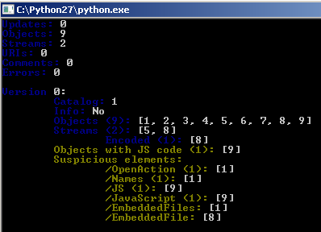

**PDF(Portable Document Format)** 파일은 Adobe에서 개발한 파일 포맷입니다. 문서의 텍스트, 이미지, 서식, 그리고 다른 요소들을 원래의 의도대로 유지하며 다양한 기기와 플랫폼에서 일관되게 표시할 수 있도록 설계되었습니다. PDF 파일은 JavaScript를 사용하여 사용자 지정 동작 구현이 가능한데, 공격자는 해당 기능을 악용하여 악성코드를 실행시킵니다.


## <mark>1. PDF 파일</mark>

PDF 파일은 가장 흔하게 사용되는 문서 파일입니다. 때문에 그 자체가 악성코드로 활용될 뿐만 아니라, 아이콘 또는 문자열 등이 다른 파일 포맷에서 PDF 위장 용도로 활용되기도 합니다.


파일 구조는 Header, Body, Cross Reference Table, Trailer로 구성되어 있습니다. 

| Info                  | Data                                                      |
| --------------------- | --------------------------------------------------------- |
| Header                | PDF 시그니처와 버전 정보                                  |
| Body                  | PDF 문서 내의 Object 데이터들이 트리 구조로 링크되어 존재 |
| Cross Reference Table | Body에 존재하는 Object들에 대한 오프셋 정보               |
| Trailer               | Xref Table, Root Object 등의 오프셋 정보                  |


## <mark>2. this.exportDataObject</mark>

**this.exportDataObject**는 PDF 파일 내부에 존재하는 첨부파일을 실행하는 메서드입니다. 공격자들은 **nLaunch == 2**를 사용해, 문서가 오픈되면 첨부파일이 임시경로에 저장 및 실행되도록 합니다.

```javascript
this.exportDataObject({
    cName: "첨부파일이름",
    nLaunch: 2 
});

//   cName: PDF 내에 첨부된 파일 이름
// nLaunch: 내보낸 파일을 자동으로 여는 옵션 
//       0: 파일 저장 (사용자가 지정한 저장 경로)
//       1: 파일 저장 및 실행 (사용자가 지정한 저장 경로)
//       2: 파일 저장 및 실행 (임시경로에 저장, 사용자에게 저장경로를 묻지 않음)
```


## <mark>3. peepdf.py</mark>

**peepdf.py**는 PDF 파일을 분석할 때 사용하는 Python 도구입니다. peepdf를 사용하면 문서 내 모든 객체를 확인하여 의심스러운 요소를 보여주며, 가장 많이 사용되는 필터와 인코딩을 지원합니다. 또한, 파일의 다양한 버전을 파싱하거나 객체 스트림 및 암호화된 파일도 처리할 수 있습니다.

> [!NOTE]
>
> 🔗 [peepdf.py](https://github.com/jesparza/peepdf)


## <mark>4. 악성 PDF 샘플 분석</mark>

### ▪ <u>의심스러운 객체 확인</u>

pdf 분석 도구 peepdf를 사용하여 pdf 내부에 의심스러운 객체가 있는지 확인합니다. 샘플의 경우, 의심스러운 JavaScript · OpenAction · EmbeddedFile 객체가 확인되었습니다.

```powershell
peepdf.py -i [file_path]
```



### ▪ <u>의심스러운 객체 분석</u>

먼저 OpenAction 객체가 존재하는 객체1을 확인합니다. 객체1에는 JavaScript 객체가 존재하는 객체9가 간접 참조되어 있습니다. 또한, EmbeddedFiles 객체 내에 eicar-dropper.doc 파일이 존재합니다.


OpenAction 객체에 간접 참조된 객체9를 확인해보니, 첨부 파일인 eicar-dropper.doc를 실행하는 this.exportDataObjectd 매서드가 확인되었습니다.


PDF 뷰어인 Acrobat으로 해당 파일을 오픈하면, 다음과 같은 알림창이 활성화되는데 OK를 누르면 첨부파일이 자동으로 저장 및 실행되게 됩니다.


문서 내부에 존재하는 eicar-dropper.doc 파일을 확인하기 위해간접 참조된 객체7을 확인합니다. 파일 내용은 객체8에  간접 참조되어 있습니다.


객체 8에서 FlateDecode로 압축되어 있는 EmbeddedFile 데이터가 확인되었습니다.


peepdf의 stream 명령어를 사용하면, 디코딩된 EmbeddedFile 데이터를 확인할 수 있습니다. MS OLE 포맷의 파일 시그니처로 보아 DOC 문서로 추정됩니다.


### ▪ <u>EmbeddedFile 분석</u>

peepdf를 사용하면 EmbeddedFile을 간단히 덤프할 수 있습니다.


덤프한 EmbeddedFile을 분석하면 추가 악성 행위를 확인할 수 있습니다.

