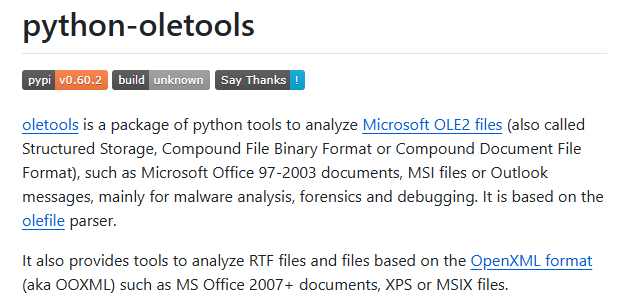

**DOC** 파일은 Microsoft Word 97 ~ 2003에서 사용되었던 포맷입니다. MS Word에서 VBA(Visual Basic for Applications) 스크립트를 사용한 자동화를 지원합니다. 공격자는 해당 기능을 악용하여 악성코드를 시스템에 배포합니다.

## <mark>1. DOC 파일</mark>

Microsoft Word 97 ~ 2003에서 메인으로 사용한 포맷으로 `DO CF 11 E0` 파일 시그니처를 가집니다. Microsoft Word 2007부터는 DOCX로 교체되었지만, 뛰어난 호환성을 가지고 있어 이후 버전에서도 DOC 문서의 작성 및 편집이 가능합니다.


기본적으로 바이너리 형식을 가지고 있기 때문에 텍스트 뷰어로는 내부 확인이 어렵지만, SSView 도구를 사용하면 내부 구조를 확인할 수 있습니다.


## <mark>2. VBA Macro</mark>

 VBA(Visual Basic for Applications) Macro는 MS Office 응용 프로그램 내에서 자동화 작업을 수행하기 위해 사용되는 프로그래밍 언어입니다. 공격자들은 윈도우의 다양한 DLL 들에 접근할 수 있다는 점을 악용하여 시스템에 악성코드를 배포합니다.

> [!NOTE]
>
> 🔗 [Visual Basic for Application](https://learn.microsoft.com/en-us/office/vba/api/overview/)


## <mark>3. oletools</mark>

oletools는 Microsoft Office 97-2003 문서, Microsoft OLE2 문서(MS-CBF), MS Office 2007+ 문서(OOXML)를 분석하기 위한 파이썬 도구 패키지입니다. 

> [!NOTE]
>
> 🔗 [oletools](https://github.com/decalage2/oletools)



## <mark>4. 악성 DOC 샘플 분석</mark>

### ▪ <u>DOC 파일 내부 정보 확인</u>

oletools 도구 중 하나인 oleid를 사용하면, 파일 내부 정보를 확인할 수 있습니다. 샘플에서는 의심스러운 VBA Macros가 있는 것으로 확인되었습니다.

```powershell
oleid [file_path]
```


### ▪ <u>VBA Macros 확인</u>

oletools 도구 중 하나인 olevba를 사용하면, VBA Macros 내의 의심스러운 키워드를 확인할 수 있습니다. 샘플의 VBA 내에서는 의심스러운 키워드가 다수 확인되었습니다.


파일 내의 VBA Macros를 텍스트 파일로 내려받을 수 도 있습니다.

```powershell
olevba dropped.doc > olevba_result
```


### ▪ <u>VBA Macros 디버깅</u>

VBA Macros 코드를 획득했다면, MS Word를 열어서 `Alt + F11`로 MS Word 내의 디버거를 실행합니다. 획득한 VBA Macros 코드를 디버깅하여 어떤 행위를 수행하는지 분석합니다.


`Ctrl + G`를 눌러 즉시 실행 창을 열고, 아래 명령어를 사용하면 원하는 변수의 값을 알 수 있습니다. 샘플의 경우, 의심스러운 파일 경로를 확인할 수 있었습니다.

```vbscript
Debug.Print [원하는 변수 명]
```

