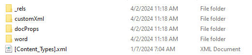
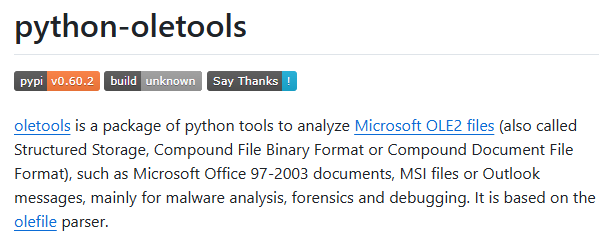

DOCX 파일은 Microsoft Word 버전 2007 이상의 기본 파일 형식이며 이전 DOC 파일 형식을 대체합니다. XML과 ZIP 압축이 결합된 Open XML 파일 형식을 기반으로, 압축 해제를 통해 내부 내용을 확인할 수 있다는 특징이 있습니다. 공격자는 VBA Macros를 지원하는 점과 외부에서 Template을 다운로드할 수 있다는 점을 악용하여 시스템에 악성코드를 배포합니다.

## <mark>1. DOCX 파일</mark>

DOCX 파일은 Microsoft Word에서 만든 문서를 만들고 저장하는데 사용되는 파일 형식입니다. Microsoft Word 버전 2007 이상의 기본 파일 형식이며 이전 DOC 파일 형식을 대체합니다. XML과 ZIP 압축이 결합된 Open XML 파일 형식을 기반으로, 압축 해제를 통해 내부 내용을 확인할 수 있습니다. 공격자는 DOC 파일과 마찬가지로 VBA Macros를 악용할 수 있을 뿐만 아니라, 외부에서 악성 VBA Macros를 포함하는 Template를 다운로드하는 기능을 사용하여 악성코드를 시스템에 배포할 수 있습니다.



## <mark>2. DOCX 파일 내부</mark>

### ▪ <u>\\word\\media\\</u>

'\\word\\media\\' 폴더에서는 문서 내부에 존재하는 이미지 파일을 확인할 수 있습니다. 악성코드는 정상적인 파일로 위장해 사용자가 VBA Macros를 활성화하도록 유도하기 위해 이미지를 활용합니다.


### ▪ <u>\\word\\rels\\settings.xml.rels</u>

'\\word\\rels\\settings.xml.rels' 파일에서는 외부로부터 다운로드하는 Template 주소를 확인할 수 있습니다. 공격자는 DOCX 문서에는 VBA Macros를 포함하지 않고, 외부로부터 악성 VBA Macros를 포함하는 Template 파일을 다운로드하는 **Template Injection** 을 사용하여 악성코드를 시스템에 배포합니다.


## <mark>3. oletools</mark>

oletools는 Microsoft Office 97-2003 문서, Microsoft OLE2 문서(MS-CBF), MS Office 2007+ 문서(OOXML)를 분석하기 위한 파이썬 도구 패키지입니다. 

> [!NOTE]
>
> 🔗 [oletools](https://github.com/decalage2/oletools)



## <mark>4. 악성 DOCX 샘플 분석</mark>

### ▪ <u>DOCX 파일 내부 정보 확인</u>

oletools 도구 중 하나인 oleid를 사용하면, DOCX 내부 정보를 확인할 수 있습니다. 샘플의 경우, **External Relationships** 외부 템플릿이 확인되었습니다.

```powershell
oleid <filename>
```


### ▪ <u>External Relationships 확인</u>

oletools 도구 중 하나인 oleobj를 사용하면, 외부 템플릿 주소를 획득할 수 있습니다.

```powershell
oleobj <filename>
```


Powershell 명령어를 사용하면, 해당 파일을 다운로드 받을 수 있습니다.

```powershell
Invoke-WebRequest -Uri <src> -OutFile <dst>
```


### ▪ <u>DOTM 파일 내부 정보 확인</u>

DOTM 파일도 DOCX 파일처럼 oleid를 사용하여 내부 정보를 확인할 수 있습니다. 의심스러운 VBA Macros가 확인되었습니다.


### ▪ <u>VBA Macros 확인</u>

olevba를 사용하여, VBA Macros를 확인하여 악성인지 분석합니다.


