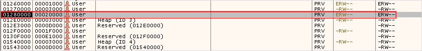
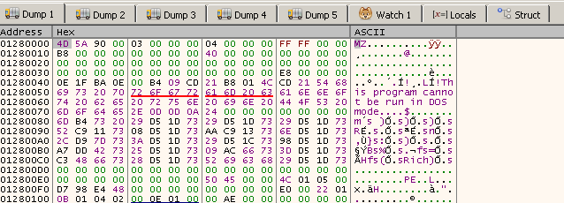
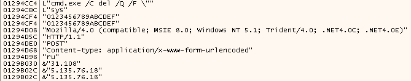
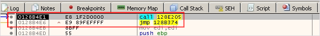

패킹은 코드를 암호화하거나 압축하여 원래 형태를 숨기는 기법입니다. 악성코드는 탐지를 회피하고 분석을 어렵게 하기 위해 패킹을 활용합니다. 패킹된 파일이 실행되면 언패킹 과정을 거치게 되는데 해당 과정에서 사용되는 API를 이용하면 OriginalEntryPoint(OEP)를 찾을 수 있습니다.

## <mark>1. 패킹된 파일</mark>

### ▪ <u>일반적인 실행 단계</u>

1. 메모리 할당
2. 페이로드 압축 해제
3. 임포트 테이블 복구
4. OEP로 이동
5. 페이로드 실행

### ▪ <u>자주 사용되는 NT API와 Win32 API</u>

| API   | Funcion                                                      |
| ----- | ------------------------------------------------------------ |
| Ntdll | LdrLoadDll, LdrGetProcedureAddress, NtAllocateVirtualMemory,<br />NtProtectVirtualMemory, NtFreeVirtualMemory, NtWriteFile, NtReadFile |
| Win32 | LoadLibrary, GetProcAddress, VirtualAlloc, VirtualProtect, VirtualFree, WriteFile, ReadFile |


## <mark>2. 패킹된 파일 실행</mark>

### 1) <u>메모리 할당</u>

로더는 언패킹된 페이로드를 저장할 메모리를 할당합니다. 일반적으로 VirtualAlloc, HeapAlloc, GlobalAlloc, RtlAllocateHeap, NtAllocateVirtualMemory와 같은 API를 여러번 호출하여 코드 및 데이터를 메모리 상에 배치합니다. 일부 로더는 패커는 샘플의 기존 메모리 공간을 덮어쓰기도 합니다. 이런 경우 메모리 할당 API의 호출이 적거나 없을 수도 있습니다.


### 2) <u>페이로드 압축 해제</u>

로더는 할당한 메모리 영역에 압축된 페이로드를 압축 해제 알고리즘을 사용해 언패킹합니다. 사용되는 알고리즘은 다양하며 Win32 API 대신 원시 어샘블리 코드만을 사용하는 경우가 일반적입니다. 일부 패커는 RtlDecompressBuffer API를 사용하여 압축을 해제하기도 합니다.


### 3) <u>임포트 테이블 복구</u>

이후 언패킹된 페이로드의 임포트 테이블을 읽어 페이로드가 의존하는 API를 찾아냅니다. LoadLibrary 또는 LdrLoadDll를 사용하여 필요한 Dll을 로드하고, GetProcAddress 또는 LdrGetProcedureAddress를 사용해 필요한 API의 주소를 획득합니다.


### 4) <u>OEP로 이동</u>

OEP는 로더가 언패킹된 페이로드로 실행을 전달할 때 첫 번째로 실행돼야 하는 명령의 주소입니다. 패커는 일반적으로는 JMP나 CALL 명령어를 사용하여 제어를 넘기는데, OEP까지 도달하는데 여러 단계의 압축 해제가 필요할 수 있기 때문에 OEP에 도달했는지 확인하기 위해서는 추가적인 확인이 필요합니다.

### 5) <u>페이로드 실행</u>

다음은 제어권이 OEP에 도착해 페이로드에 있는지 확인하기 위한 API 유형입니다.

- 디스크에 새 파일 생성
- 파일에 쓰기
- 레지스트리 키 및 값 생성
- 네트워크 연결
- 새로운 프로세스 생성
- 원격 프로세스 열기 및 쓰기
- 원격 프로세스에서 스레드 생성


## <mark>3. 디버거를 사용한 수동 언패킹</mark>

### ▪ <u>수동 언패킹 단계</u>

1. 메모리에서 압축 해제 또는 언패킹된 페이로드의 위치 파악
2. 페이로드를 디스크에 덤프

#### 1) <u>페이로드의 위치 파악</u>

RegCreateKeyExA를 호출하는 페이로드 코드 이전에 호출되는 LdrGetProcedureAddress API의 호출이 임포트 테이블 복구 단계라고 추정할 수 있습니다. 그렇다면 LdrGetProcdureAddress와 RegCreateKeyExA에 OEP로 JMP할 가능성이 높습니다.


디버거의 조건부 중단점을 활용하여 LdrGetProcedureAddress의 파라미터로 CryptReleaseContext가 전달될 때까지 실행합니다. RegCreateKeyExA가 실행되기까지 총 2번의 CryptReleaseContext를 파라미터로 가지는 LdrGetProcedureAddress는 총 2번 실행되므로 2번째 호출까지 디버깅을 진행합니다.

```python
strstr(ansi([esp+0x10](esp+0x10)), "CryptReleaseContext")
```


BP가 걸린 후 디버깅을 진행하면 LdrGetProcedureAddress API를 호출한 함수의 주소를 알 수 있습니다.


이번에는 RegCreateKeyExA에 BP를 걸고 디버깅을 진행합니다. 마찬가지로 RegCreateKeyExA에 BP가 걸린 후 디버깅을 진행하여 해당 API가 호출된 함수 주소를 파악합니다.


Memory Map을 확인해보면 두 주소는 기존 바이너리의 ImageBase가 아닌 128000 메모리 블록에서 실행된 것을 알 수 있습니다. 이것은 두 함수 모두 언패킹된 페이로드에서 실행되었거나 아직 언패킹 중이라고 해석할 수 있습니다. 해당 메모리 블록의 시작부분이 PE 포맷을 가지고 있는 것으로 보아 128000 메모리 블록은 언패킹된 페이로드일 확률이 높습니다.





의심스러운 내부 문자열 또한 확인이 가능했습니다.



#### 2) <u>페이로드를 디스크에 덤프</u>

언패킹된 페이로드를 찾았지만, 정확한 OEP의 위치는 아직 알 수 없습니다. OllyDumpEx의 Search 기능을 활용하면 이미지 상의 OEP를 알려주긴 합니다만, PE가 많이 훼손된 상태라면 정확한 OEP가 아닐 수도 있습니다. 그럴 경우 추가적인 분석을 통해 정확한 OEP를 찾아야 합니다. 해당 과정에서 잘못 선택된 섹션은 선택 해제 해줘야 합니다.


정확한 OEP를 확인하기 위해서는 덤프한 PE를 IDA, Ghidra와 같은 정적 분석 도구로 내부 코드를 확인해보거나 동적 디버깅을 통해 코드를 하나하나 확인해봐야 합니다. 멀웨어 중에서는 임포트 테이블이나 PE 구조를 심하게 훼손하는 경우도 존재하므로 덤프된 pe가 무조건 실행되리라는 보장은 없습니다.

### ▪ <u>수동 OEP 검색</u>

예를 들어 NtAllocateVirtualMemory를 사용해 언패킹 코드를 저장할 0x20000 사이즈의 가상 메모리를 할당받는 코드에 BP를 설치합니다. 해당 코드는 언패킹 페이로드를 저장할 메모리를 할당받는 코드일 확률이 높습니다.


BP가 걸린 후, 디버깅을 해나가다보면 언패킹하는 부분을 확인할 수 있습니다. 그후에 할당한 VM으로 이동하는 코드가 존재하는데 반환 주소를 조작하는 방식을 이용하는 것을 확인할 수 있습니다.


언패킹된 코드 블록으로 이동한 후에는 특정 함수 내부로 이동하는데 EP처럼 보이지 않으므로 좀 더 진행하다보면 OEP처럼 보이는 코드가 보입니다. OEP로 추정되는 위치에 EIP를 위치시키고 OllyDumpEx의 Get EIP as OEP 기능을 사용해 Dump하면 됩니다.



