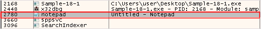
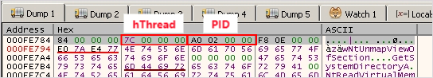
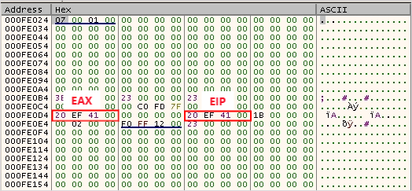

악성코드는 자신의 행위를 은폐하거나 더 높은 권한을 사용하기 위해 특정 프로세스에 코드를 주입하는데, 이것을 인젝션이라고 합니다.  인젝션 기번에는 DLL 인젝션, Thread 인젝션, Context 변경 등 다양한 기법이 존재합니다. 이때 삽입된 코드의 첫 바이트부터 실행 가능한 코드가 있을 필요는 없습니다. 예를 들어 주입된 코드가 DLL인 경우, 첫 번째 바이트는 PE 헤더로 시작하고 실행 코드는 DLL 내부 어딘가에 존재하게 됩니다. 

## <mark>1. IEP, Injection Entry Point</mark>

대상 프로세스에 악성 코드를 삽입한 후 인젝터는 대상 프로세스의 내부에서 삽입된 코드를 실행해야 합니다. 인젝터가 결정하는 대상 프로세스의 삽입된 코드 내부에서 실행을 시작하는 주소를 IEP라고 합니다. 일반적으로 IEP는 인젝터에서 결정되므로 인젝터를 디버깅하면 IEP 단서를 얻을 수 있습니다.

## <mark>2. CreateRemoteThread를 활용한 인젝션</mark>

대상 프로세스 내부에 실행하고자 하는 코드를 배치하고 스레드를 생성하여 실행하는 기법으로 일반적으로 활용되는 방식입니다.

### ▪ <u>코드 실행</u> 

CreateRemoteThread를 활용한 인젝션 코드의 일반적인 실행 단계

1. CreateToolhelp32Snapshot 등의 API를 활용하여 대상 프로세스를 찾음.
2. NtOpenProcess 등의 API로 대상 프로세스의 핸들을 찾음.
3. NtAllocateVirtualMemory 등의 API로 대상 프로세스 내에 메모리를 할당.
4. WriteProcessMemory 등의 API로 대상 프로세스 내에 인젝션 코드를 복사.
5. CreateRemoteThread를 호출하여 대상 프로세스 내의 인젝션 코드를 원격으로 실행.

악성코드는 가장 먼저 CreateToolhelp32Snapshot, Process32FirstW, Process32NextW API들을 사용하여 코드가 삽입될 프로세스를 찾습니다.

대상 프로세스를 발견했다면, 해당 프로세스의 핸들을 획득하고 해당 프로세스 내에 VM을 생성한 후 인젝션 코드를 작성합니다. 작성이 완료되었다면 CreateRemoteThread를 호출하여 인젝션된 코드를 실행합니다.

### ▪ <u>코드 디버깅</u>

CreateRemoteThread를 활용한 인젝션 코드 디버깅 단계

1. 대상 프로세스의 PID 확인
2. 대상 프로세스에 메모리를 할당하는 코드 확인
3. 할당된 메모리에 인젝션 코드를 작성하는 코드 확인
4. CreateRemoteThread API에서 IEP 획득
5. 대상 프로세스에 디버거 attach

#### 1. 대상 프로세스의 PID와 Handle을 확인

NtOpenProcess에 중단점을 설정하여 대상 프로세스의 PID와 Handle을 확인합니다. 샘플에서 확인된 PID는 0xADC(2780), Process Handle은 0x9C 입니다.

#### 2. 대상 프로세스에 메모리를 할당하는 코드 확인

인젝터 프로세스는 획득한 Process Handle을 사용하여 대상 프로세스 내에 메모리를 할당합니다. NtAllocateVirtualMemory에 대상 프로세스의 Process Handle을 전달하는 코드를 찾기 위해 조건부 BP를 설정하여 할당하는 메모리 주소를 획득할 수 있습니다. 샘플에서는 0x320000 주소에 메모리를 할당합니다.

#### 3. 할당된 메모리에 인젝션 코드를 작성하는 코드 확인

VirtualAlloc 아래쪽에 WriteProcessMemory API가 존재하는데 해당 API에 전달되는 인수들을 확인하면 인젝션되는 코드를 확인할 수 있습니다. 

ProcessHacker 도구를 사용하면, 대상 프로세스 내에 인젝션된 코드를 확인할 수 있습니다.

#### 4. CreateRemoteThread API에서 IEP 획득

CreateRemoteThread API의 StartAddress 파라미터에 원격 스레드가 실행을 시작해야되는 IEP 주소가 전달됩니다.

#### 5. 대상 프로세스에 디버거 attach

디버거를 열어 대상 프로세스의 PID를 찾고 attach 합니다. StartAddress를 찾아 BP를 설치하고 run을 눌러 대상 프로세스를 실행시킵니다. 

인젝터로 다시 돌아와서 CreateRemoteThread API를 실행시키면, 대상 프로세스의 StartAddress에서 BP가 걸린 것을 확인할 수 있습니다.

가끔 프로세스 할로잉에서 아직 프로세스가 일시 중단 상태일 때는 디버거가 해당 프로세스에 attach하지 못할 수도 있습니다. 이런 경우 StartAddress의 시작 코드를 0xEBFE로 변경하는 기법을 시도해야 합니다.

## <mark>3. Thread Context를 활용한 인젝션</mark>

멀웨어가 대상 프로세스에서 코드를 실행하는 데 사용하는 또 다른 방법은 대상 프로세스에서 원격 스레드의 콘텍스트를 변경하는 것입니다. 스레드 콘텍스트 내에는 레지스터의 상태, 프로세스이 메인 모듈의 진입점 등과 같은 다양한 정보를 저장할 수 있는 구조체입니다. 스레드 컨텍스트를 변경하려면, 작업 스케줄러가 해당 콘텍스트를 변경하지 않도록 스레드가 일시 중지 상태이어야 합니다.

### ▪ <u>코드 실행</u> 

Thread Context를 활용한 인젝션 코드의 일반적인 실행 단계

1. 대상 프로세스를 suspend 상태로 실행
2. 인젝터는 GetThreadContext를 사용해 대상 프로세스 스레드의 콘텍스트 구조 복사본을 검색
3. 다음 콘텍스트 구조체의 로컬 복사본을 대상으로 프로세스에서 삽입된 코드의 위치에 따라 변경
4. 콘텍스트 구조의 변경된 로컬 복사본은 SetThreadContext API를 사용해 대상 프로세스로 다시 복사
5. 자신을 종료

### ▪ <u>코드 디버깅</u>

Thread Context를 활용한 인젝션 코드 디버깅 단계

1. CreateProcessInternalW API에 전달된 인수를 확인하여 대상 프로세스의 정보를 확인
2. SetThreadContext API에서 ThreadContext 데이터를 확인

#### 1. CreateProcessInternalW API에 전달된 인수를 확인하여 대상 프로세스의 정보를 확인

CreateProcessInternalW에는 대상 프로세스의 위치와 PROCESS_INFORMATION 구조체 주소가 전달됩니다. PROCESS_INFORMATION 구조체 내부에서 대상 프로세스의 PID 정보를 획득 가능합니다.

CreateProcessInternalW를 실행하게 되면 대상 프로세스가 SUSPEND로 실행되면서 전달된 PROCESS_INFORMATION가 채워지게 되고, 대상 프로세스의 Thread Handle과 PID를 확인할 수 있습니다.

#### 2. SetThreadContext API에서 ThreadContext 데이터를 확인

악성코드는 SUSPEND된 Thread를 Resume하기 전에, SetThreadContext를 사용하여 대상 프로세스에 변경된 ThreadContext를 설정합니다. 해당 ThreadContext 내에 EAX(+0xb0), EIP(+0xb8) 필드에 IEP가 설정되어 있습니다.

#### 3. 대상 프로세스에 디버거 attach

대상 프로세스에 디버거를 attach하고 IEP에 중단점을 설정 후, 인젝터에서 ResumeThread를 호출하면 대상 프로세스의 EIP부터 디버깅이 가능합니다.

## <mark>+ EBFE 기법</mark>

대상 프로세스에서 EIP가 실행되기 전에, ProcessHacker를 사용하여 첫 번째 2바이트를 기록한 후, EBFE로 변경하는 기법입니다.

EBFE로 변경 후, 인젝터 프로세스에서 Thread를 실행하게 되면, 대상 프로세스는 IEP에서 무한 루프가 걸려 있는 상태가 됩니다. 디버거를 실행하여 실행 중인 대상 프로세스에 attach한 후 일시정지를하면 루프 무한 루프 걸린 부분에 멈추게 되고, 다시 코드를 원본 바이트인 FC33으로 패치 후 디버깅합니다.

