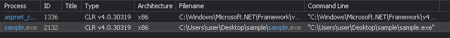
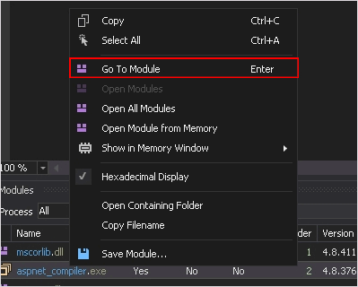
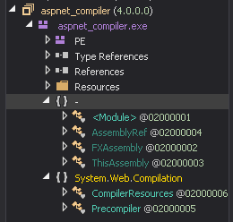

**DotNet** 사용량이 증가하면서 공격자들 또한  DotNet으로 작성된 패커나 악성코드를 사용하는 사례가 증가하고 있습니다. 일반적으로 내부의 암호화된 악성 모듈을 복호화 및 로드하여 실행하기 때문에 어떤 모듈들을 로드하는지 확인할 필요가 있습니다. 의심스러운 모듈이 확인되었다면, DotNet 디버거인 dnspy를 attach하여 어떤 행위를 하는지 분석합니다.

## <mark>1. 악성 DotNet 샘플 분석</mark>

### ▪ <u>ProcessHacker를 사용해 모듈 확인</u>

샘플 .NET 파일을 실행했는데, 하위 프로세스로 aspent_compliler.exe를 실행함을 확인했습니다.

해당 하위 프로세스에 로드된 모듈들을 확인한 결과, vik라는 의심스러운 모듈을 확인할 수 있었습니다.

### ▪ <u>dnspy를 사용해 모듈 분석</u>

dnspy의 attach to process 기능을 사용하여 의심스러운 프로세스에 attach 합니다.

dnspy를 사용하면 attach한 프로세스의 modules을 확인할 수 있습니다.

Go To Module로 의심스러운 모듈을 확인합니다. 이때 확인되는 정보는 디스크 상의 정보로 의심스러운 API를 확인할 수 없습니다. 디스크 상의 정보를 확인하는 이유는 모듈이 할로잉되었는지 확인하기 위함입니다. 일반적은 프로세스는 프로세스를 할로잉하지 않습니다.

Open Module from Memory로 해당 모듈의 메모리를 확인합니다. 이때 확인되는 정보는 메모리 상의 정보로 의심스러운 API를 확인할 수 있습니다. 만약 디스크 상과 메모리 상의 코드가 다르다면, 정상적인 파일을 호출한 후 메모리 상에서 이미지를 덮어 쓰는 할로잉이 되었을 가능성이 높습니다.

Go to EntryPoint를 사용하면 EP 코드를 확인할 수 있습니다.

