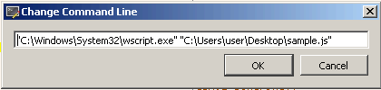
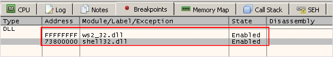
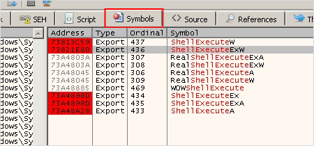
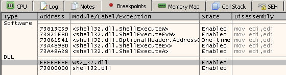
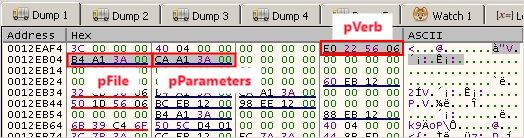
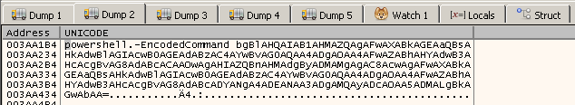

JavaScript는 웹 브라우저에서 실행되는 클라이언트 사이드 스크립트 언어입니다. 일반적으로 HTML 포맷의 악성코드에서 자주 사용되며, 오픈소스 난독화 도구를 사용해 분석가가 분석하기 어렵게 만들기도 합니다.


## <mark>1. Java Script</mark>

### ▪ <u>자주 사용되는 함수</u>

```javascript
eval            // 평가 표현식
replace         // 문자열에서 부분 문자열의 발생을 대체
split           // 구분 기호를 사용해 문자열 분할
join            // 구분 기호로 두 문자열을 결합
fromCharCode    // 유니코드 값을 문자로 변환
operator        // 문자열 연결
concat          // 문자열 연결
document.write  // HTML 문서에 쓰기
console.log     // 브라우저 콘솔에 쓰기
```

## <mark>2. Malzilla</mark>

> [!NOTE]
>
> 🔗 [malzilla](https://www.malzilla.org/downloads.html)

텍스트 편집기로 악성 자바 스크립트를 확인하게 되면 한눈에 보기 어려운 형태를 가지고 있습니다. Malzilla 도구를 사용하면 난독화된 JavaScript를 분석할 때 도움이 됩니다. Malzilla의 Format code 기능을 사용하면 코드를 어느 정도 보기 좋게 정리해줍니다.


악성코드가 문자열로 악성 명령어를 작성한 후 eval 함수를 사용해 악성행위를 수행하는 경우라면, Run script 기능을 사용해 eval 함수에 전달된 내용을 확인할 수 있습니다. 


eval 함수에 전달되는 코드를 다시 복사해서 Format code 기능을 사용하면 의심스러운 문자열들을 확인할 수 있습니다.


## <mark>3. WSCRIPT</mark>

간혹 eval 함수를 사용하지 않는 javascript도 존재합니다. 이때는 윈도우 프로세스인 wscript.exe를 사용하면 해당 javascript가 어떤 행위를 수행하는지 확인할 수 있습니다. wscript를 x32dbg로 실행 후 command line에 분석하고자 하는 javascript 파일을 파라미터로 전달합니다.



네트워크 관련 기능을 수행하는 ws2_32.dll과 쉘 관련 기능을 수행하는 shell32.dll에 BP를 설정합니다.



shell32.dll이 로드되고 BP가 걸리면, ShellExecute API 들에 BP를 설정하고 앞서 걸었던 shell32.dll BP 제거 후 진행합니다.





ShellExecuteEx에 전달되는 파라미터를 확인하면 JavaScript가 하고자하는 행위를 확인할 수 있습니다.



