RTF(Rich Text Format) 파일은 Microsoft가 개발한 규격으로 크로스 플랫폼 문서 교환을 위하여 만들어진 문서 형식의 파일입니다. 공격자는 해당 파일이 취약점이 존재하는 OLE 수식 객체를 포함할 수 있는 점을 악용해 시스템에 악성코드를 배포합니다.

## <mark>1. RTF 파일</mark> 


RTF (Rich Text Format)는 Microsoft에 의해 개발되었습니다. 1987년 처음 도입되어, 다양한 텍스트 편집기와 워드 프로세서 간의 호환성을 제공하기 위해 설계되었습니다. Microsoft Word와 함께 RTF는 널리 사용되며, 버전에 따라 다르긴 하지만 대부분의 문서 처리 프로그램은 rtf 파일을 읽고 쓸 수 있습니다.  내부에 ole 객체를 포함할 수 있는데, 이로 인해 발생하는 취약점을 악용한 악성코드가 대부분입니다.

- 파일 시그니처 = `{\rt`, `7B 5C 72 74`

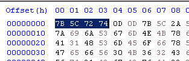

## <mark>2. rtfdump.py</mark>

rtf 파일을 분석할 수 있는 도구로 파일 구조를 확인하고 내부에 있는 객체를 검색 및 덤프할 수 있음.

> [!NOTE]
>
> [rtfdump.py](https://blog.didierstevens.com/2022/10/22/update-rtfdump-py-version-0-0-12/)


## <mark>3. 악성 RTF 샘플 분석</mark>

### ▪ <u>rtf 파일 내부 확인</u>

rtf 파일은 난독화가 가능하기 때문에 rtfdump와 rtfobj의 기본 기능만으로는 ole 파일을 찾지 못할 수도 있습니다. rtfdump의 `-F` 옵션을 사용하면 OLE 임베디드 데이터를 찾아줍니다.

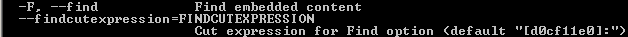

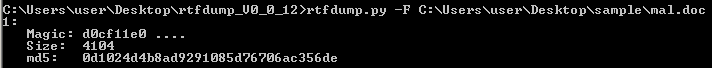

### ▪ <u>임베디드 ole 파일 데이터 확인</u>

`-s` 옵션을 사용하면 equAtIon 문자열을 확인할 수 있는데, 이는 수식 취약점을 이용 했을 확률이 높습니다.

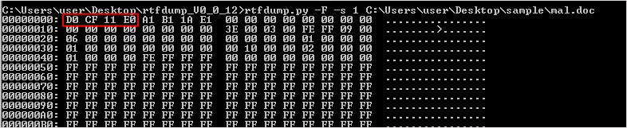

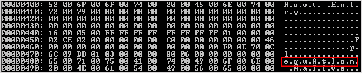

`-d` 옵션을 사용해 의심스러운 ole 객체를 덤프합니다.

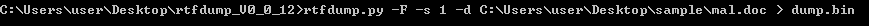

### ▪ <u>ole 파일 내부 확인</u>

oletools 도구 중 oledir를 사용하면 내부를 확인할 수 있습니다. rtf 파일에 임베디드된 ole 파일은 루트 항목에 clsid가 내장되어 있는 것을 확인할 수 있습니다.

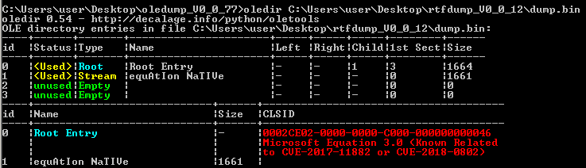

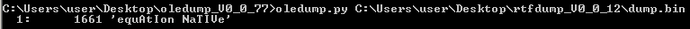

oledump.py 도구의  `--storage` 옵션을 사용해도 내부 구조를 확인할 수 있습니다.

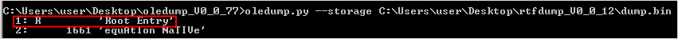

`-E "%CLSID% %CLSIDDESC%"` 옵션을 사용하면 clsid와 cve까지 확인 가능합니다. 

```
oledump.py --storage -E "%CLSID% %CLSIDDESC%" [file_path]
```

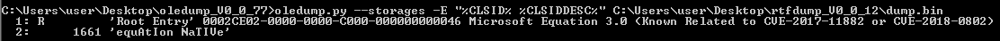

확인한 clsid는 `0002CE02-0000-0000-C000-000000000046`로 `Microsoft Equation 3.0`를 나타냅니다. 이는 수식 취약점을 이용했을 가능성이 높다는 것을 의합니다. regedit을 통해 clsid를 검색해보면 취약점이 존재하는 **EQNEDT32.exe** 프로그램을 사용함을 알 수 있습니다.

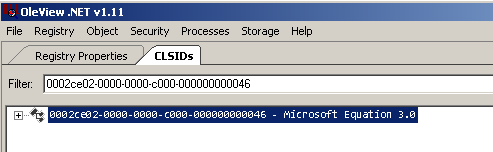

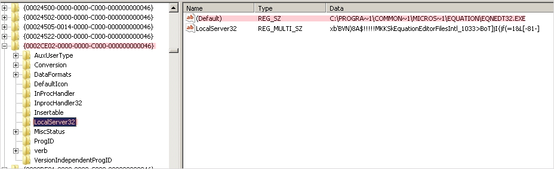

oledump.py를 사용해서 equation NaTIVe 객체 스트림을 덤프합니다.

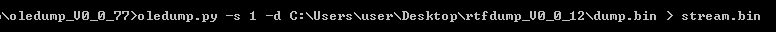

### ▪ <u>ole 객체 스트림 분석</u>

rtf 악성 코드는 일반적으로 Font Record 0x8 값 이후에 나오는 Font Name 데이터에 40 byte 이상의 값을 넣어 EIP 제어하는 방식으로 동작합니다. 하지만 EQNEDT32.exe 내부에서 ole 객체에 존재하는  MTEF 바이트 스트림을 어떻게 파싱하냐에 따라서 shellcode의 위치가 달라집니다. 또한 어떤 취약점을 사용하냐에 따라서 overwrite되는 메모리 크기도 달라지기도 합니다.

> [!NOTE]
>
>  🔗 [MTEF Header Info](https://rtf2latex2e.sourceforge.net/MTEF3.html#header_v2+)

때문에 특정 방법을 사용하기 보다는 헤더 정보를 참고하여 취약점이 존재하는 Font Record와 Matrix Record를 파싱해 의심스러운 부분을 파악하거나, EQNEDT32.exe에 디버거를 붙여서 분석해야 합니다. gflags 도구를 이용하면 특정 프로그램 실행 시, 원하는 디버거를 붙일 수 있습니다.

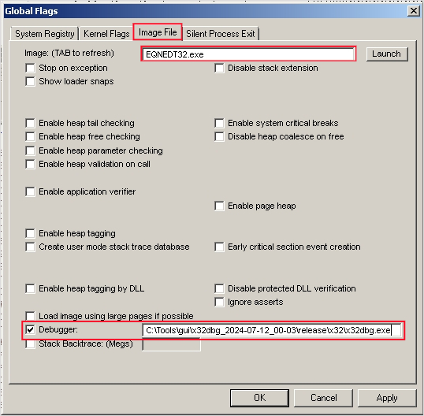

gflags를 설정한 후, 파일을 열면 x32dbg가 실행되고 EQNEDT32.exe 내부를 확인할 수 있습니다.

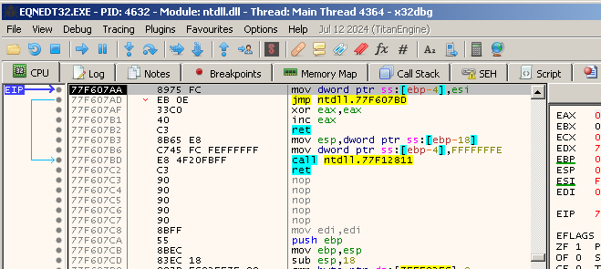