## <mark> ▸Virtual Machine Version</mark> 

| VM    | OS           | CPU  | RAM  | Disk |
| :---- | ------------ | ---- | ---- | ---- |
| Host  | ubuntu 22.04 | 4    | 8    | 60   |
| Guest | Win10x64     | 2    | 4    | 40   |


## <mark> ▸Set Host VM</mark> 

> [!NOTE]
>
> CAPE 공식 문서에서는 ubuntu 22.04를 추천하며, VM 생성 시 AMD-V 옵션을 활성화해야 합니다.


###   1. <u>자동 업데이트 끄기</u>

ubuntu 설정의 Software & Updates에서 업데이트 관련 옵션을 끕니다.


아래 명령어를 사용하여 업데이트 관련 파일 내용을 수정합니다.

```bash
sudo nano /etc/apt/apt.conf.d/10periodic
```

```bash
APT::Periodic::Update-Package-Lists "0";
APT::Periodic::Download-Upgradeable-Packages "0";
APT::Periodic::AutocleanInterval "0";
APT::Periodic::Unattended-Upgrade "0";
```


###   2. <u>화면 보호기 끄기</u>

Ubuntu의 Settings > Screen 설정에서 화면 잠금 관련 설정을 끕니다.


###   3. <u>Install KVM & Virt-Manager</u>

아래 명령어를 사용하여 GuestVM으로 사용할 kvm, virt-manager를 설치합니다.

```bash
sudo apt update && sudo apt upgrade -y && sudo reboot
sudo apt-get install -y git build-essential cmake ninja-build python3-dev cython3 pybind11-dev python3-pip libre2-dev acpica-tools net-tools gperf dbus-x11 graphviz graphviz-dev

wget https://raw.githubusercontent.com/doomedraven/Tools/master/Virtualization/kvm-qemu.sh

# acpi 설정
mkdir temp && cd temp
sudo acpidump > acpidump.out
sudo acpixtract -a acpidump.out
sudo iasl -d dsdt.dat
cd ..
sed -i 's/<WOOT>/*아래 스샷에서 박스가 가리키는 문자열*/g' kvm-qemu.sh
```


```bash
sudo chmod +x kvm-qemu.sh
sudo ./kvm-qemu.sh all cape | tee kvm-qemu.log
sudo reboot
sudo ./kvm-qemu.sh virtmanager cape | tee kvm-qemu-virtmanager.log
sudo reboot
```


###   4. <u>Install CAPE</u>

아래 명령어를 사용하여  Cape를 설치합니다.

```bash
git clone https://github.com/kevoreilly/CAPEv2.git
cd CAPEv2/installer

# NETWORK_IFACE, PASSWD 변경
sudo nano cape2.sh
```


```bash
sudo chmod +x cape2.sh
sudo ./cape2.sh base | tee cape.log
sudo reboot

# psql 설정
sudo -u postgres psql
ALTER DATABASE cape OWNER TO cape;
\q

# poetry 필요 패키지 설치
cd /opt/CAPEv2
sudo poetry install
sudo -u cape poetry run pip install -r extra/optional_dependencies.txt
```


###   5. <u>Set CAPE</u>

아래 명령어를 사용하여 cuckoo.conf를 수정합니다.

```bash
# cuckoo.conf 수정
nano conf/cuckoo.conf
```


free space가 부족하다는 오류가 뜰 때가 있는데, 아래 설정을 변경해주면 됩니다.


아래 명령어를 사용하여 kvm.conf를 수정합니다.

```bash
# kvm.config 수정  
nano conf/kvm.conf
```


아래 명령어를 사용하여 routing.conf를 수정합니다.

```bash
# routing.conf
nano conf/routing.conf
```


## <mark> ▸Set Guest VM</mark> 

###  1. <u>Create VM</u>

게스트 Win10을 설치하기 전에 아래 파일들을 준비합니다. CAPE에서는 파이썬 3.10.6 32bit 버전을 설치를 권장합니다.

```bash
# 디펜더 리무버
https://github.com/ionuttbara/windows-defender-remover/releases/download/release_def_12_8/DefenderRemover.exe

# 윈도우 커스텀 ps
https://github.com/W4RH4WK/Debloat-Windows-10

# python 3.10.6 32
https://www.python.org/ftp/python/3.10.6/python-3.10.6.exe
```

Virt-Manger로 VM을 생성합니다. CAPE에서는 게스트 OS로 Win10 x64 21H2를 권장합니다.


VM 명은 앞서 kvm.conf에서 설정한 이름과 같게 해야 합니다. 인터넷이 연결되어 있으면 오류가 발생할 수 있기 때문에 ubuntu의 web-connection을 off 합니다.

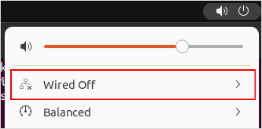

###  2. <u>윈도우 설정</u>

Win10 설치가 완료되면 윈도우 보안에 가서 Virus & threat protection setting에 존재하는 모든 기능을 off 합니다.


Windows Defender FireWall With Advanced Security에서 Domain, Private, Public 방화벽을 Off 합니다.


ubuntu에서 python을 사용해 간단히 웹서버 생성합니다.

```
python3 -m http.server 8080
```

윈도우 VM에서 virbr0 ip로 접속하면 아래와 같이 파일을 확인할 수 있습니다.


앞서 준비한 파일들을 다운로드합니다. CAPEv2/agent/agent.py도 내용을 복사해서 파일을 생성합니다. 악성코드의 샌드박스 탐지 회피를 위해 agent.py라는 이름을 그대로 사용하지 않습니다. 다운로드가 완료되면 웹서버는 Ctrl + C로 종료합니다.


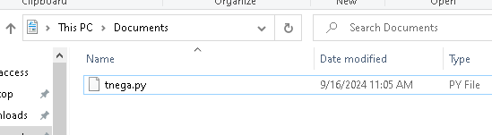

DefendRemover.exe를 관리자 권한으로 실행 후 Y 입력합니다. 실행이 완료되면 자동으로 재시작됩니다.

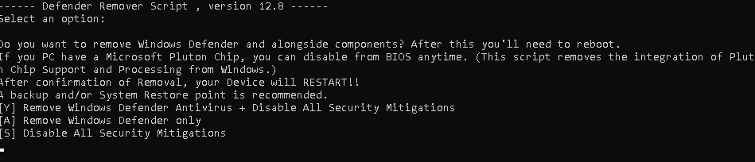

재시작 후에는 Services에 들어가서 Windows Update 서비스를 Stop하고 Disabled 합니다.


python을 설치합니다. 이때 아래 체크박스를 체크해야 합니다.


설치가 완료되면 인터넷을 다시 연결하고 아래 패키지를 다운로드합니다.

```
python -m pip install --upgrade pip
python -m pip install --upgrade pillow
```

파워셀을 관리자 권한으로 실행 후 아래 코드 입력합니다.

```powershell
Set-ExecutionPolicy Unrestricted # A 입력
netsh interface teredo set state disabled
```


gpedit을 설치 후 아래 설정을 활성화합니다.

```cmd
FOR %F IN ("%SystemRoot%\servicing\Packages\Microsoft-Windows-GroupPolicy-ClientTools-Package~*.mum") DO (DISM /Online /NoRestart /Add-Package:"%F")
FOR %F IN ("%SystemRoot%\servicing\Packages\Microsoft-Windows-GroupPolicy-ClientExtensions-Package~*.mum") DO (DISM /Online /NoRestart /Add-Package:"%F")
```

Computer Configuration > Administrative Templates > Network > DNS Client > Turn off Multicast Name Resolution => Eanbled

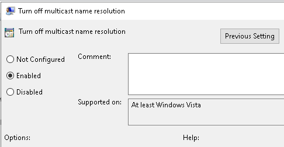

Computer Configuration > Administrative Templates > System > Internet Communication Management > Restrict Internet Communication => Eanbled


###  3. <u>Debloat Scripts 실행</u>

`disable-services.ps1`, `block-telemetry.ps1`, `remove-default-apps.ps1`, `remove-onedrive.ps1` 스크립트를 실행 후, utils 폴더로 이동해 `disable-scheduled-tasks.ps1`를 실행합니다.

```powershell
cd C:\User\user\Download\Debloat-Windows-10-master\scripts\
ls -Recurse *.ps*1 | Unblock-File
```


###  4. <u>가상 네트워크 구성</u>

Virt-Manager에서 default network를 삭제하고 hostonly 가상 네트워크를 생성합니다.


Win10 x64 머신의 NIC를 hostonly로 변경합니다.


게스트 윈도우의 Network and Sharing Center에서 아래와 같이 ip 설정합니다. kvm.conf에서 설정한 것과 같은 ip를 사용해야 합니다.


###  5. <u>agent.py 설정</u>

agent.py가 시스템 재시작 시에도 실행되도록 스케줄러에 등록합니다.

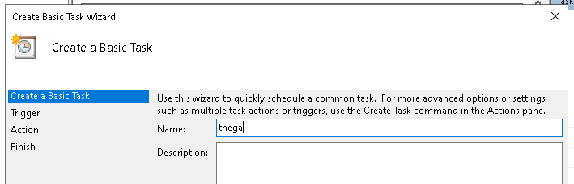

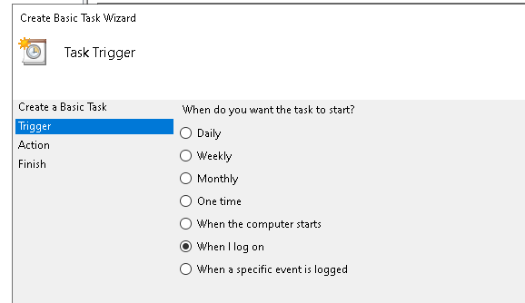

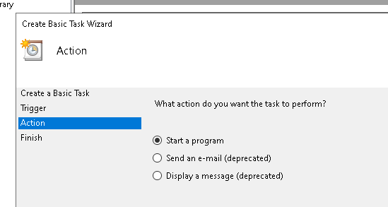

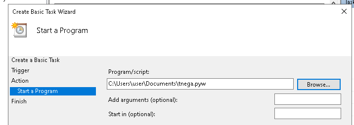

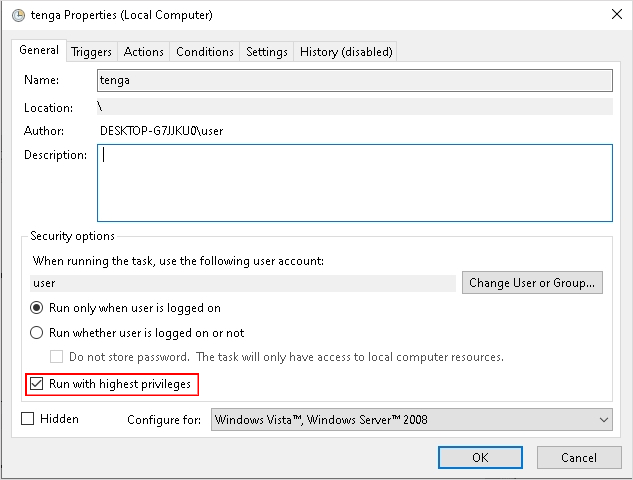

시스템 재로그인 후 ubuntu의 curl 명령어를 사용해 agent.py가 제대로 설정되었는지 확인합니다.

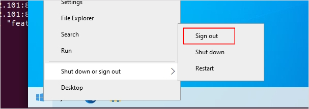

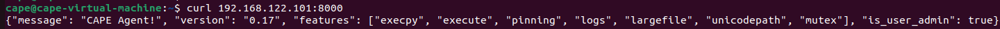

제대로 설정되었다면 스냅샷 생성합니다.


## <mark> ▸CAPE 재실행 및 Rooter 실행</mark> 

CAPE의 설정을 바꿨을 경우, 아래 코드를 실행해줘야 합니다.

```bash
cd /opt/CAPEv2
sudo systemctl restart cape*
sudo poetry run python3 utils/rooter.py -v -g cape
```

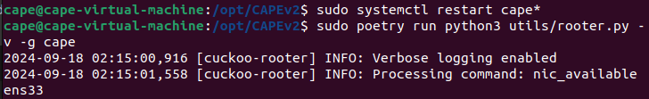

아래 주소로 접근하면 CAPE 웹 인터페이스에 접근 가능합니다.ㄴ

```
http://192.168.10.136:8000/
```

