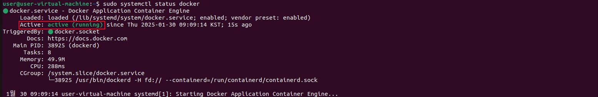
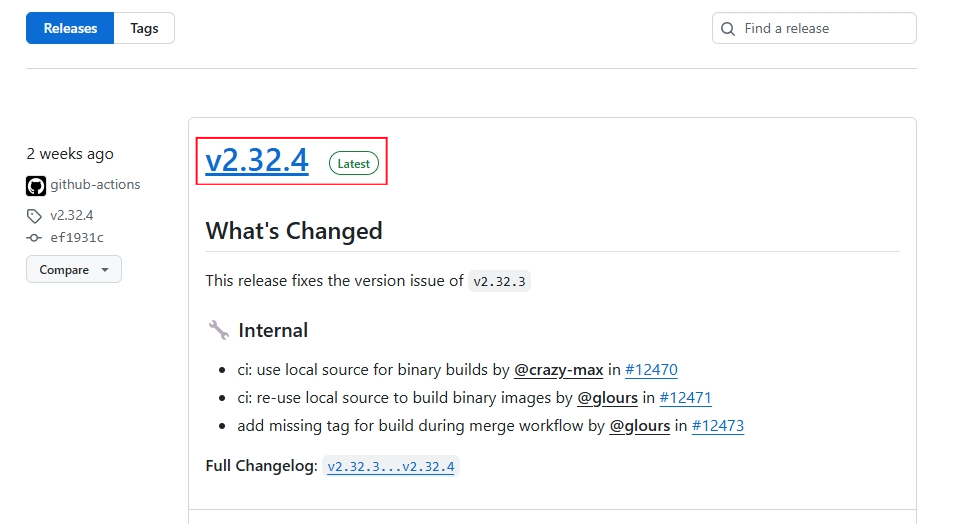
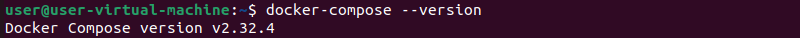

## <mark>🖥️Ubuntu22.04</mark>

### 📌<u>Install Docker</u>
#### 1. System Update

```shell
sudo apt update -y
sudo apt upgrade -y
```

#### 2. Install Dependency Packages
```shell
sudo apt install apt-transport-https ca-certificates curl software-properties-common -y
```
#### 3. Add GPG key

>[!note]
>
> GPG 키(GNU Privacy Guard 키)는 데이터 암호화와 서명에 사용되는 공개 키 암호화 시스템의 일종. GPG는 주로 이메일 암호화, 파일 암호화 및 소프트웨어 패키지의 진위를 검증하기 위해 사용. 

```shell
curl -fsSL https://download.docker.com/linux/ubuntu/gpg | sudo gpg --dearmor -o /usr/share/keyrings/docker-archive-keyring.gpg
```
#### 4. Set Repository
```shell
echo "deb [arch=$(dpkg --print-architecture) signed-by=/usr/share/keyrings/docker-archive-keyring.gpg] https://download.docker.com/linux/ubuntu $(lsb_release -cs) stable" | sudo tee /etc/apt/sources.list.d/docker.list > /dev/null

sudo apt update
```
#### 5. Install
```shell
sudo apt install docker-ce docker-ce-cli containerd.io -y
```
#### 6. Start
```shell
sudo systemctl start docker
sudo systemctl enable docker
```
#### 7. Check Status
```
sudo systemctl status docker
```

#### 8. Run
```shell
sudo docker run hello-world
```


### 📌<u>Install Docker-Compose</u>

#### 1. Download & Install

> [!NOTE]
>
> 🔗[Docker-Compose Release](https://github.com/docker/compose/releases)

위 링크에서 도커 최신 버전 확인 후 명령어의 버전 부분을 수정하여 다운로드 및 설치 진행



```shell
sudo curl -L "https://github.com/docker/compose/releases/download/v2.32.4/docker-compose-$(uname -s)-$(uname -m)" -o /usr/local/bin/docker-compose
```
#### 2. Set Execution Permission
```shell
sudo chmod +x /usr/local/bin/docker-compose
```
#### 3. Check Installation
```shell
docker-compose --version
```


